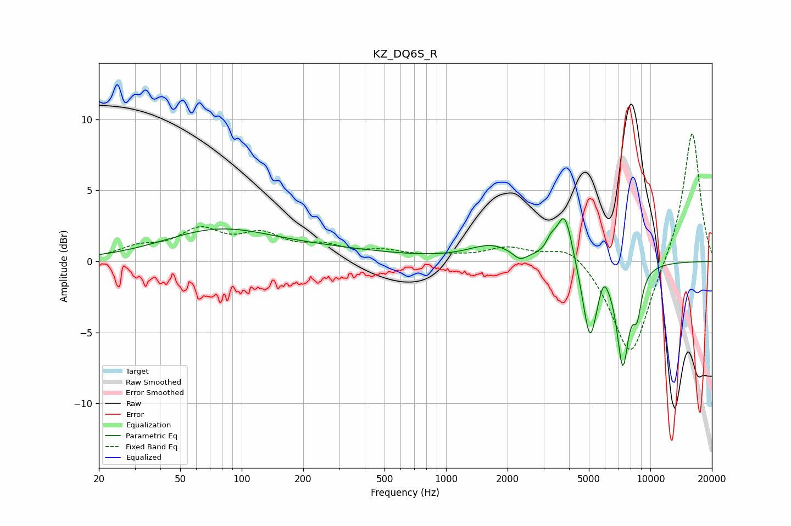

# KZ_DQ6S_R
See [usage instructions](https://github.com/jaakkopasanen/AutoEq#usage) for more options and info.

### Parametric EQs
Apply preamp of -3.1 dB when using parametric equalizer.

|   # | Type    |   Fc (Hz) |    Q |   Gain (dB) |
|-----|---------|-----------|------|-------------|
|   1 | Peaking |        76 | 0.53 |         2.1 |
|   2 | Peaking |       271 | 0.44 |         0.6 |
|   3 | Peaking |      1671 | 1.26 |         1.1 |
|   4 | Peaking |      2300 | 4.2  |        -0.6 |
|   5 | Peaking |      3263 | 5.98 |         0.7 |
|   6 | Peaking |      3806 | 3.64 |         3.6 |
|   7 | Peaking |      5061 | 3.92 |        -5.5 |
|   8 | Peaking |      5897 | 5.94 |         1.1 |
|   9 | Peaking |      7326 | 4.53 |        -6.7 |
|  10 | Peaking |      8611 | 5.73 |        -2.6 |

### Fixed Band EQs
When using fixed band (also called graphic) equalizer, apply preamp of **-9.1 dB** (if available) and set gains manually with these parameters.

|   # | Type    |   Fc (Hz) |    Q |   Gain (dB) |
|-----|---------|-----------|------|-------------|
|   1 | Peaking |        31 | 1.41 |         0.8 |
|   2 | Peaking |        62 | 1.41 |         2   |
|   3 | Peaking |       125 | 1.41 |         1.6 |
|   4 | Peaking |       250 | 1.41 |         0.9 |
|   5 | Peaking |       500 | 1.41 |         0.6 |
|   6 | Peaking |      1000 | 1.41 |         0.3 |
|   7 | Peaking |      2000 | 1.41 |         0.9 |
|   8 | Peaking |      4000 | 1.41 |         1.3 |
|   9 | Peaking |      8000 | 1.41 |        -6.9 |
|  10 | Peaking |     16000 | 1.41 |         9.4 |

### Graphs

