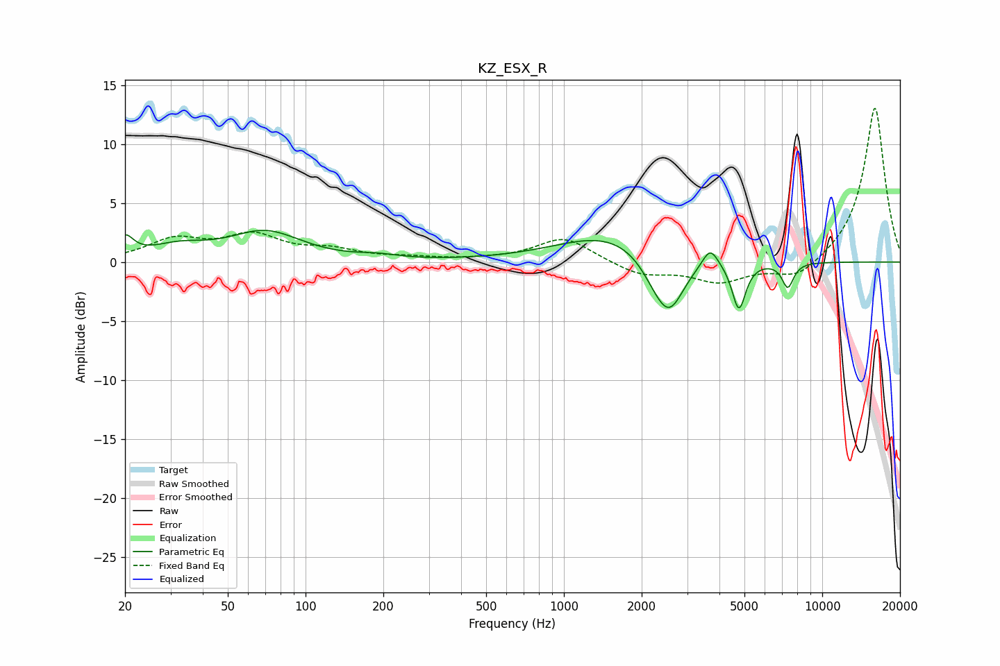

# KZ_ESX_R
See [usage instructions](https://github.com/jaakkopasanen/AutoEq#usage) for more options and info.

### Parametric EQs
Apply preamp of -2.8 dB when using parametric equalizer.

|   # | Type    |   Fc (Hz) |    Q |   Gain (dB) |
|-----|---------|-----------|------|-------------|
|   1 | Peaking |        20 | 4.36 |         1.7 |
|   2 | Peaking |        32 | 1.31 |         1.1 |
|   3 | Peaking |        70 | 1.02 |         2.5 |
|   4 | Peaking |       190 | 1.82 |         0.3 |
|   5 | Peaking |      1510 | 0.71 |         2.4 |
|   6 | Peaking |      2261 | 2.31 |        -1.4 |
|   7 | Peaking |      2568 | 2.42 |        -4.3 |
|   8 | Peaking |      3683 | 4.67 |         1.7 |
|   9 | Peaking |      4757 | 5.33 |        -4.1 |
|  10 | Peaking |      7357 | 6    |        -2.1 |

### Fixed Band EQs
When using fixed band (also called graphic) equalizer, apply preamp of **-13.1 dB** (if available) and set gains manually with these parameters.

|   # | Type    |   Fc (Hz) |    Q |   Gain (dB) |
|-----|---------|-----------|------|-------------|
|   1 | Peaking |        31 | 1.41 |         1.8 |
|   2 | Peaking |        62 | 1.41 |         2.1 |
|   3 | Peaking |       125 | 1.41 |         0.9 |
|   4 | Peaking |       250 | 1.41 |         0.3 |
|   5 | Peaking |       500 | 1.41 |         0.1 |
|   6 | Peaking |      1000 | 1.41 |         2.1 |
|   7 | Peaking |      2000 | 1.41 |        -1.1 |
|   8 | Peaking |      4000 | 1.41 |        -1.6 |
|   9 | Peaking |      8000 | 1.41 |        -1.5 |
|  10 | Peaking |     16000 | 1.41 |        13.2 |

### Graphs

