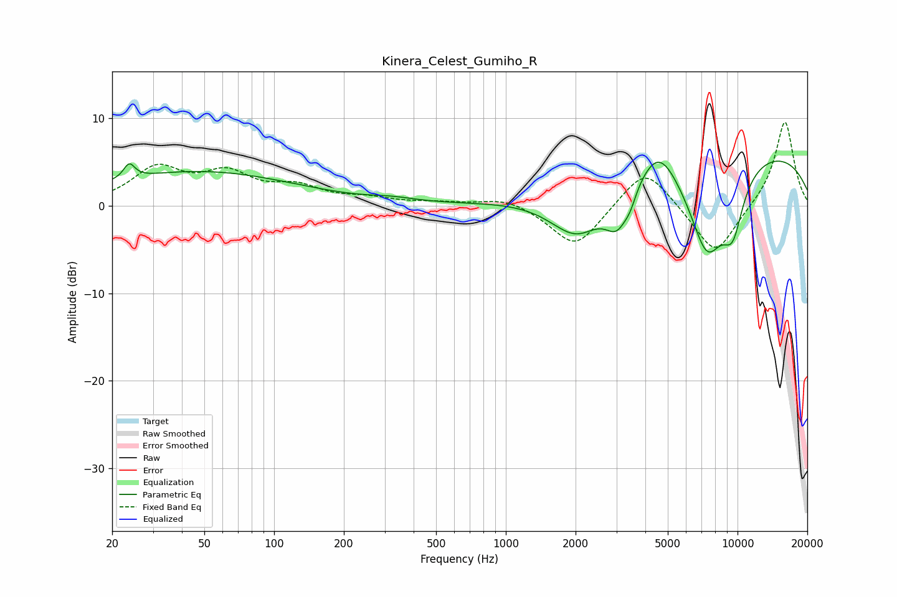

# Kinera_Celest_Gumiho_R
See [usage instructions](https://github.com/jaakkopasanen/AutoEq#usage) for more options and info.

### Parametric EQs
Apply preamp of -5.2 dB when using parametric equalizer.

|   # | Type    |   Fc (Hz) |    Q |   Gain (dB) |
|-----|---------|-----------|------|-------------|
|   1 | Peaking |        24 | 6    |         1.7 |
|   2 | Peaking |        47 | 0.34 |         3.9 |
|   3 | Peaking |       325 | 1.48 |         0.4 |
|   4 | Peaking |      2032 | 1.15 |        -5.9 |
|   5 | Peaking |      3031 | 2.66 |        -4.4 |
|   6 | Peaking |      3444 | 5.5  |        -1.2 |
|   7 | Peaking |      4570 | 1.75 |         3.9 |
|   8 | Peaking |      7378 | 1.52 |       -11   |
|   9 | Peaking |      9106 | 0.2  |         7   |
|  10 | Peaking |      9533 | 2.64 |        -5.8 |

### Fixed Band EQs
When using fixed band (also called graphic) equalizer, apply preamp of **-9.6 dB** (if available) and set gains manually with these parameters.

|   # | Type    |   Fc (Hz) |    Q |   Gain (dB) |
|-----|---------|-----------|------|-------------|
|   1 | Peaking |        31 | 1.41 |         4   |
|   2 | Peaking |        62 | 1.41 |         3.2 |
|   3 | Peaking |       125 | 1.41 |         1.8 |
|   4 | Peaking |       250 | 1.41 |         0.7 |
|   5 | Peaking |       500 | 1.41 |         0.3 |
|   6 | Peaking |      1000 | 1.41 |         1   |
|   7 | Peaking |      2000 | 1.41 |        -4.9 |
|   8 | Peaking |      4000 | 1.41 |         4.7 |
|   9 | Peaking |      8000 | 1.41 |        -5.9 |
|  10 | Peaking |     16000 | 1.41 |         9.9 |

### Graphs

