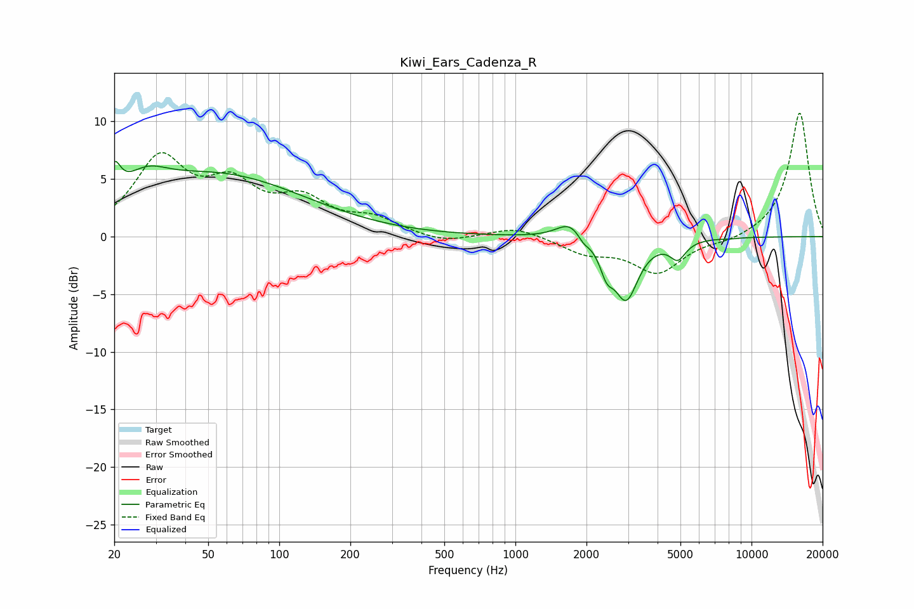

# Kiwi_Ears_Cadenza_R
See [usage instructions](https://github.com/jaakkopasanen/AutoEq#usage) for more options and info.

### Parametric EQs
Apply preamp of -6.6 dB when using parametric equalizer.

|   # | Type    |   Fc (Hz) |    Q |   Gain (dB) |
|-----|---------|-----------|------|-------------|
|   1 | Peaking |        20 | 5.56 |         2.6 |
|   2 | Peaking |        27 | 1.56 |         2   |
|   3 | Peaking |        55 | 0.38 |         5.2 |
|   4 | Peaking |      1707 | 2.48 |         1.5 |
|   5 | Peaking |      1932 | 5.88 |         2.6 |
|   6 | Peaking |      1934 | 5.87 |        -3.2 |
|   7 | Peaking |      2433 | 5.12 |        -1.9 |
|   8 | Peaking |      2943 | 2.77 |        -5.2 |
|   9 | Peaking |      4875 | 4.24 |        -1.6 |
|  10 | Peaking |      8141 | 4.08 |        -0.1 |

### Fixed Band EQs
When using fixed band (also called graphic) equalizer, apply preamp of **-10.8 dB** (if available) and set gains manually with these parameters.

|   # | Type    |   Fc (Hz) |    Q |   Gain (dB) |
|-----|---------|-----------|------|-------------|
|   1 | Peaking |        31 | 1.41 |         6.5 |
|   2 | Peaking |        62 | 1.41 |         3.8 |
|   3 | Peaking |       125 | 1.41 |         2.8 |
|   4 | Peaking |       250 | 1.41 |         1.4 |
|   5 | Peaking |       500 | 1.41 |        -0.6 |
|   6 | Peaking |      1000 | 1.41 |         0.9 |
|   7 | Peaking |      2000 | 1.41 |        -1.3 |
|   8 | Peaking |      4000 | 1.41 |        -3.1 |
|   9 | Peaking |      8000 | 1.41 |        -0.4 |
|  10 | Peaking |     16000 | 1.41 |        10.8 |

### Graphs

