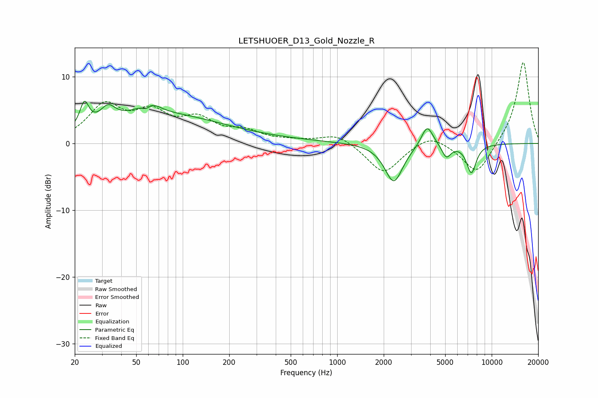

# LETSHUOER_D13_Gold_Nozzle_R
See [usage instructions](https://github.com/jaakkopasanen/AutoEq#usage) for more options and info.

### Parametric EQs
Apply preamp of -6.4 dB when using parametric equalizer.

|   # | Type    |   Fc (Hz) |    Q |   Gain (dB) |
|-----|---------|-----------|------|-------------|
|   1 | Peaking |        23 | 5.02 |         3.7 |
|   2 | Peaking |        33 | 2.97 |         2.3 |
|   3 | Peaking |        58 | 3.67 |        -3.9 |
|   4 | Peaking |        59 | 2.8  |         4.9 |
|   5 | Peaking |        71 | 0.36 |         3.7 |
|   6 | Peaking |       136 | 0.18 |         0.6 |
|   7 | Peaking |      2325 | 2.42 |        -5.8 |
|   8 | Peaking |      3826 | 3.69 |         3.2 |
|   9 | Peaking |      5090 | 4.85 |        -2   |
|  10 | Peaking |      7389 | 4.3  |        -4.3 |

### Fixed Band EQs
When using fixed band (also called graphic) equalizer, apply preamp of **-12.2 dB** (if available) and set gains manually with these parameters.

|   # | Type    |   Fc (Hz) |    Q |   Gain (dB) |
|-----|---------|-----------|------|-------------|
|   1 | Peaking |        31 | 1.41 |         5.4 |
|   2 | Peaking |        62 | 1.41 |         4   |
|   3 | Peaking |       125 | 1.41 |         3.1 |
|   4 | Peaking |       250 | 1.41 |         1.6 |
|   5 | Peaking |       500 | 1.41 |         0.3 |
|   6 | Peaking |      1000 | 1.41 |         1.5 |
|   7 | Peaking |      2000 | 1.41 |        -4.6 |
|   8 | Peaking |      4000 | 1.41 |         1.7 |
|   9 | Peaking |      8000 | 1.41 |        -4.8 |
|  10 | Peaking |     16000 | 1.41 |        12.5 |

### Graphs

