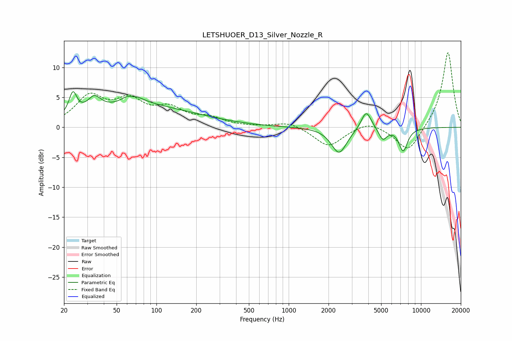

# LETSHUOER_D13_Silver_Nozzle_R
See [usage instructions](https://github.com/jaakkopasanen/AutoEq#usage) for more options and info.

### Parametric EQs
Apply preamp of -6.1 dB when using parametric equalizer.

|   # | Type    |   Fc (Hz) |    Q |   Gain (dB) |
|-----|---------|-----------|------|-------------|
|   1 | Peaking |        23 | 4.86 |         3.7 |
|   2 | Peaking |        34 | 2.88 |         2.4 |
|   3 | Peaking |        65 | 2.97 |         4.5 |
|   4 | Peaking |        65 | 3.71 |        -3.2 |
|   5 | Peaking |        76 | 1.01 |         0.6 |
|   6 | Peaking |        78 | 0.31 |         3.2 |
|   7 | Peaking |      2403 | 2.43 |        -4.3 |
|   8 | Peaking |      3856 | 3.72 |         3.2 |
|   9 | Peaking |      5147 | 4.63 |        -2   |
|  10 | Peaking |      7343 | 4.04 |        -3.8 |

### Fixed Band EQs
When using fixed band (also called graphic) equalizer, apply preamp of **-12.6 dB** (if available) and set gains manually with these parameters.

|   # | Type    |   Fc (Hz) |    Q |   Gain (dB) |
|-----|---------|-----------|------|-------------|
|   1 | Peaking |        31 | 1.41 |         4.8 |
|   2 | Peaking |        62 | 1.41 |         3.9 |
|   3 | Peaking |       125 | 1.41 |         2.7 |
|   4 | Peaking |       250 | 1.41 |         1.3 |
|   5 | Peaking |       500 | 1.41 |         0   |
|   6 | Peaking |      1000 | 1.41 |         1   |
|   7 | Peaking |      2000 | 1.41 |        -3.2 |
|   8 | Peaking |      4000 | 1.41 |         1.2 |
|   9 | Peaking |      8000 | 1.41 |        -4.3 |
|  10 | Peaking |     16000 | 1.41 |        12.8 |

### Graphs

