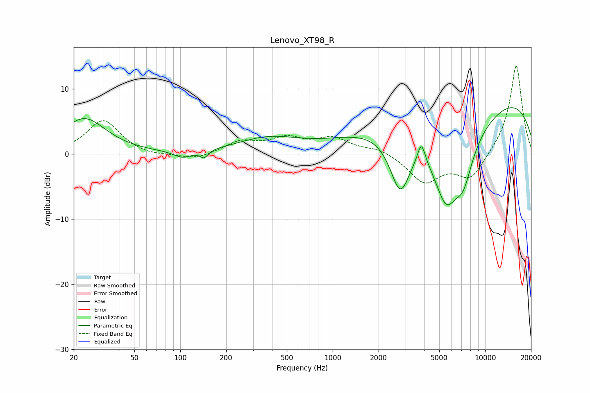

# Lenovo_XT98_R
See [usage instructions](https://github.com/jaakkopasanen/AutoEq#usage) for more options and info.

### Parametric EQs
Apply preamp of -7.2 dB when using parametric equalizer.

|   # | Type    |   Fc (Hz) |    Q |   Gain (dB) |
|-----|---------|-----------|------|-------------|
|   1 | Peaking |        23 | 1    |         5.4 |
|   2 | Peaking |       104 | 2.37 |        -1.1 |
|   3 | Peaking |       143 | 5.42 |        -1.1 |
|   4 | Peaking |       376 | 0.69 |         2.3 |
|   5 | Peaking |      2775 | 1.95 |        -9.7 |
|   6 | Peaking |      3817 | 5.63 |         3.3 |
|   7 | Peaking |      5545 | 1.48 |       -11.4 |
|   8 | Peaking |      7211 | 2.29 |        -4.9 |
|   9 | Peaking |      7571 | 0.57 |        -4.6 |
|  10 | Peaking |      8707 | 0.18 |        10.7 |

### Fixed Band EQs
When using fixed band (also called graphic) equalizer, apply preamp of **-13.7 dB** (if available) and set gains manually with these parameters.

|   # | Type    |   Fc (Hz) |    Q |   Gain (dB) |
|-----|---------|-----------|------|-------------|
|   1 | Peaking |        31 | 1.41 |         5.2 |
|   2 | Peaking |        62 | 1.41 |        -0.5 |
|   3 | Peaking |       125 | 1.41 |        -0.9 |
|   4 | Peaking |       250 | 1.41 |         1.8 |
|   5 | Peaking |       500 | 1.41 |         2.1 |
|   6 | Peaking |      1000 | 1.41 |         2.2 |
|   7 | Peaking |      2000 | 1.41 |         0.9 |
|   8 | Peaking |      4000 | 1.41 |        -4.3 |
|   9 | Peaking |      8000 | 1.41 |        -3.9 |
|  10 | Peaking |     16000 | 1.41 |        13.9 |

### Graphs

