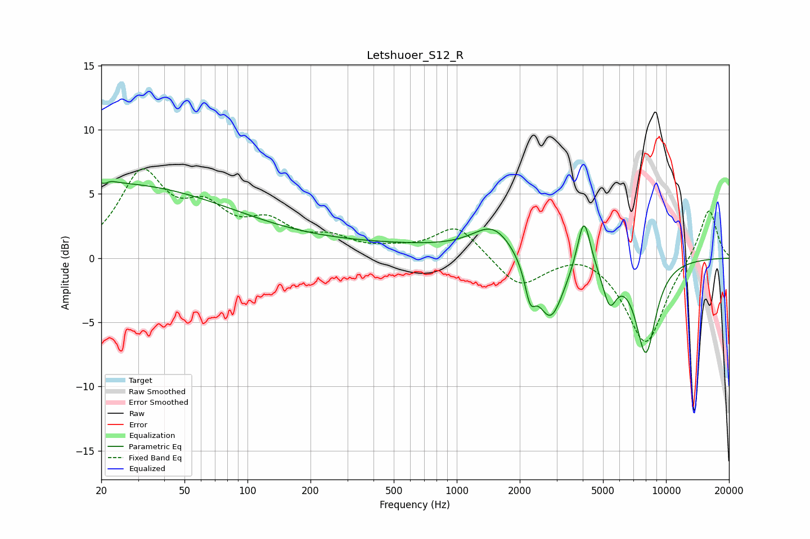

# Letshuoer_S12_R
See [usage instructions](https://github.com/jaakkopasanen/AutoEq#usage) for more options and info.

### Parametric EQs
Apply preamp of -6.1 dB when using parametric equalizer.

|   # | Type    |   Fc (Hz) |    Q |   Gain (dB) |
|-----|---------|-----------|------|-------------|
|   1 | Peaking |        20 | 0.22 |         5.8 |
|   2 | Peaking |        21 | 6    |        -2.5 |
|   3 | Peaking |        21 | 5.68 |         2.5 |
|   4 | Peaking |       334 | 0.25 |         1   |
|   5 | Peaking |      1503 | 1.44 |         2.3 |
|   6 | Peaking |      2243 | 5.58 |        -2.4 |
|   7 | Peaking |      2803 | 2.22 |        -4.9 |
|   8 | Peaking |      4050 | 4.5  |         4.3 |
|   9 | Peaking |      5379 | 4.14 |        -2.8 |
|  10 | Peaking |      8006 | 2.68 |        -7.2 |

### Fixed Band EQs
When using fixed band (also called graphic) equalizer, apply preamp of **-7.0 dB** (if available) and set gains manually with these parameters.

|   # | Type    |   Fc (Hz) |    Q |   Gain (dB) |
|-----|---------|-----------|------|-------------|
|   1 | Peaking |        31 | 1.41 |         6.3 |
|   2 | Peaking |        62 | 1.41 |         3.1 |
|   3 | Peaking |       125 | 1.41 |         2.3 |
|   4 | Peaking |       250 | 1.41 |         1.3 |
|   5 | Peaking |       500 | 1.41 |         0.4 |
|   6 | Peaking |      1000 | 1.41 |         2.5 |
|   7 | Peaking |      2000 | 1.41 |        -2.3 |
|   8 | Peaking |      4000 | 1.41 |         0.7 |
|   9 | Peaking |      8000 | 1.41 |        -6.8 |
|  10 | Peaking |     16000 | 1.41 |         4   |

### Graphs

