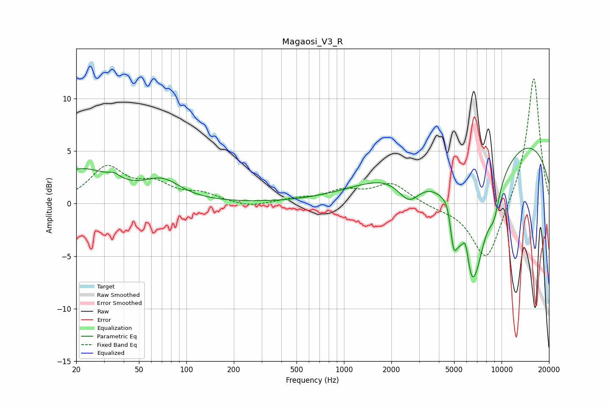

# Magaosi_V3_R
See [usage instructions](https://github.com/jaakkopasanen/AutoEq#usage) for more options and info.

### Parametric EQs
Apply preamp of -5.4 dB when using parametric equalizer.

|   # | Type    |   Fc (Hz) |    Q |   Gain (dB) |
|-----|---------|-----------|------|-------------|
|   1 | Peaking |        21 | 0.71 |         3.2 |
|   2 | Peaking |        35 | 4.12 |         0.5 |
|   3 | Peaking |        71 | 1.22 |         1.8 |
|   4 | Peaking |      2594 | 1.85 |        -2.7 |
|   5 | Peaking |      4722 | 3.73 |         2.7 |
|   6 | Peaking |      4936 | 5.6  |        -4.5 |
|   7 | Peaking |      5921 | 5.95 |         3.1 |
|   8 | Peaking |      6426 | 1.32 |       -15   |
|   9 | Peaking |      8746 | 0.18 |         7.4 |
|  10 | Peaking |      8977 | 3.86 |        -2.1 |

### Fixed Band EQs
When using fixed band (also called graphic) equalizer, apply preamp of **-12.0 dB** (if available) and set gains manually with these parameters.

|   # | Type    |   Fc (Hz) |    Q |   Gain (dB) |
|-----|---------|-----------|------|-------------|
|   1 | Peaking |        31 | 1.41 |         3.3 |
|   2 | Peaking |        62 | 1.41 |         1.6 |
|   3 | Peaking |       125 | 1.41 |         0.8 |
|   4 | Peaking |       250 | 1.41 |        -0.4 |
|   5 | Peaking |       500 | 1.41 |         0.4 |
|   6 | Peaking |      1000 | 1.41 |         1.1 |
|   7 | Peaking |      2000 | 1.41 |         1.9 |
|   8 | Peaking |      4000 | 1.41 |        -0.3 |
|   9 | Peaking |      8000 | 1.41 |        -5.7 |
|  10 | Peaking |     16000 | 1.41 |        12.3 |

### Graphs

