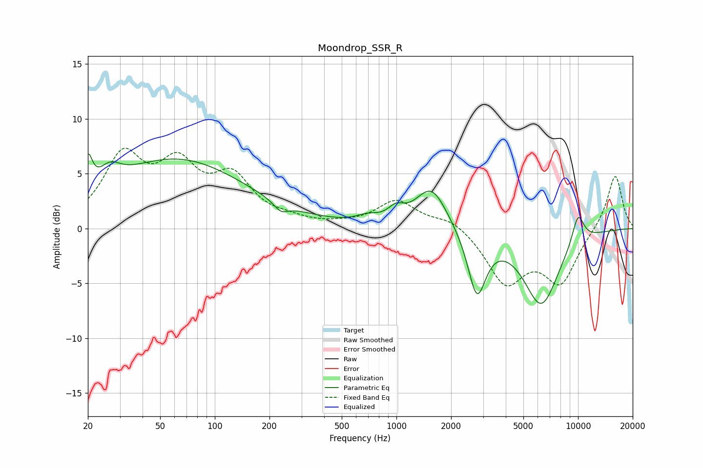

# Moondrop_SSR_R
See [usage instructions](https://github.com/jaakkopasanen/AutoEq#usage) for more options and info.

### Parametric EQs
Apply preamp of -6.9 dB when using parametric equalizer.

|   # | Type    |   Fc (Hz) |    Q |   Gain (dB) |
|-----|---------|-----------|------|-------------|
|   1 | Peaking |        20 | 5.97 |         3.1 |
|   2 | Peaking |        26 | 2.37 |         1.6 |
|   3 | Peaking |        62 | 0.37 |         6.2 |
|   4 | Peaking |       231 | 3.57 |        -0.9 |
|   5 | Peaking |       691 | 2.39 |         0.6 |
|   6 | Peaking |       994 | 3.19 |         1   |
|   7 | Peaking |      1560 | 1.64 |         3.8 |
|   8 | Peaking |      2774 | 2.84 |        -5.9 |
|   9 | Peaking |      6274 | 1.38 |        -6.9 |
|  10 | Peaking |     10000 | 3.55 |         2.8 |

### Fixed Band EQs
When using fixed band (also called graphic) equalizer, apply preamp of **-7.4 dB** (if available) and set gains manually with these parameters.

|   # | Type    |   Fc (Hz) |    Q |   Gain (dB) |
|-----|---------|-----------|------|-------------|
|   1 | Peaking |        31 | 1.41 |         6.2 |
|   2 | Peaking |        62 | 1.41 |         5   |
|   3 | Peaking |       125 | 1.41 |         4.1 |
|   4 | Peaking |       250 | 1.41 |         0.5 |
|   5 | Peaking |       500 | 1.41 |         0.2 |
|   6 | Peaking |      1000 | 1.41 |         2.5 |
|   7 | Peaking |      2000 | 1.41 |         1   |
|   8 | Peaking |      4000 | 1.41 |        -4.8 |
|   9 | Peaking |      8000 | 1.41 |        -4.7 |
|  10 | Peaking |     16000 | 1.41 |         5   |

### Graphs

