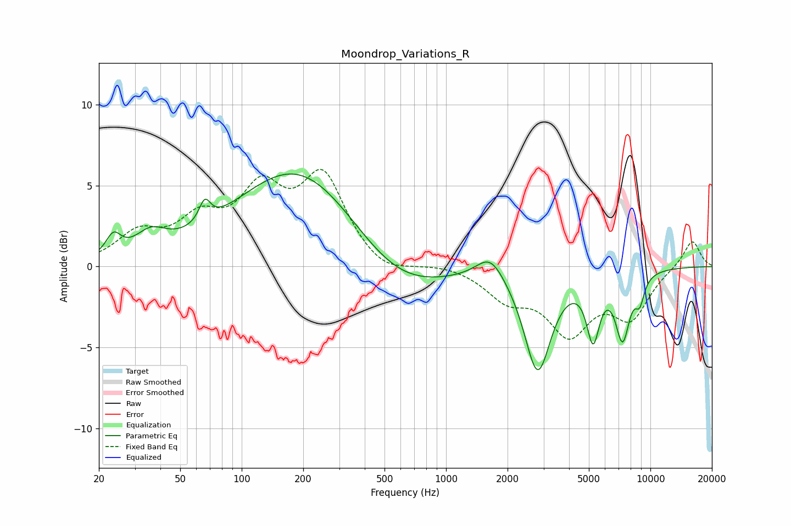

# Moondrop_Variations_R
See [usage instructions](https://github.com/jaakkopasanen/AutoEq#usage) for more options and info.

### Parametric EQs
Apply preamp of -5.8 dB when using parametric equalizer.

|   # | Type    |   Fc (Hz) |    Q |   Gain (dB) |
|-----|---------|-----------|------|-------------|
|   1 | Peaking |        24 | 3.92 |         1.3 |
|   2 | Peaking |        36 | 1.86 |         1.3 |
|   3 | Peaking |        66 | 5.13 |         1.4 |
|   4 | Peaking |       193 | 0.46 |         6.4 |
|   5 | Peaking |       565 | 0.6  |        -2.6 |
|   6 | Peaking |      1647 | 2.09 |         1.5 |
|   7 | Peaking |      2807 | 2.18 |        -6.3 |
|   8 | Peaking |      5243 | 4.41 |        -3.7 |
|   9 | Peaking |      7311 | 3.77 |        -4   |
|  10 | Peaking |      8869 | 5.67 |        -1.4 |

### Fixed Band EQs
When using fixed band (also called graphic) equalizer, apply preamp of **-6.1 dB** (if available) and set gains manually with these parameters.

|   # | Type    |   Fc (Hz) |    Q |   Gain (dB) |
|-----|---------|-----------|------|-------------|
|   1 | Peaking |        31 | 1.41 |         1.8 |
|   2 | Peaking |        62 | 1.41 |         2.4 |
|   3 | Peaking |       125 | 1.41 |         4.1 |
|   4 | Peaking |       250 | 1.41 |         5.2 |
|   5 | Peaking |       500 | 1.41 |        -0.7 |
|   6 | Peaking |      1000 | 1.41 |         0.2 |
|   7 | Peaking |      2000 | 1.41 |        -1.8 |
|   8 | Peaking |      4000 | 1.41 |        -3.8 |
|   9 | Peaking |      8000 | 1.41 |        -2.9 |
|  10 | Peaking |     16000 | 1.41 |         1.7 |

### Graphs

