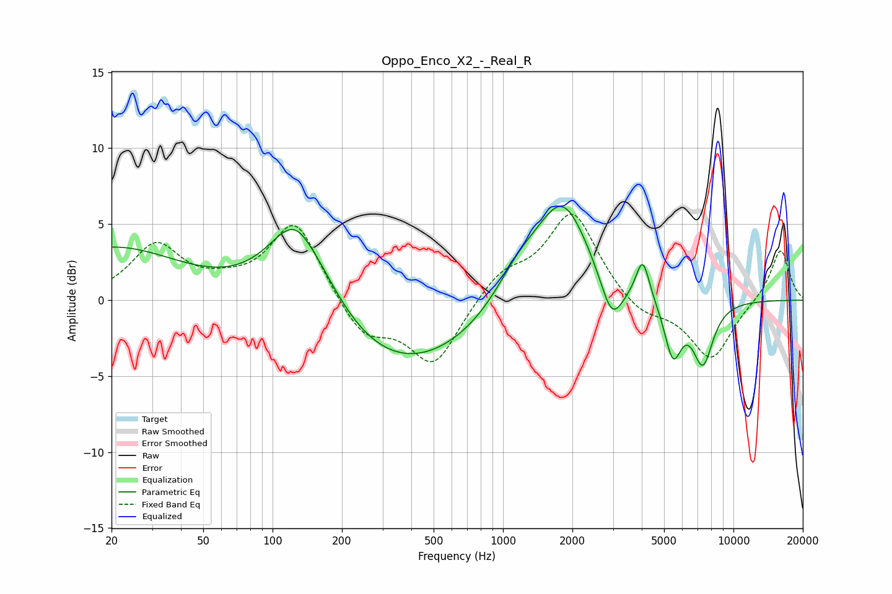

# Oppo_Enco_X2_-_Real_R
See [usage instructions](https://github.com/jaakkopasanen/AutoEq#usage) for more options and info.

### Parametric EQs
Apply preamp of -6.3 dB when using parametric equalizer.

|   # | Type    |   Fc (Hz) |    Q |   Gain (dB) |
|-----|---------|-----------|------|-------------|
|   1 | Peaking |        20 | 0.48 |         3.4 |
|   2 | Peaking |       131 | 1.07 |         7.2 |
|   3 | Peaking |       144 | 2.36 |        -0.6 |
|   4 | Peaking |       347 | 0.4  |        -4.8 |
|   5 | Peaking |      1167 | 1.34 |         2.1 |
|   6 | Peaking |      1816 | 1.2  |         6.6 |
|   7 | Peaking |      2968 | 2.84 |        -3   |
|   8 | Peaking |      4040 | 4.83 |         2.7 |
|   9 | Peaking |      5465 | 3.73 |        -3.6 |
|  10 | Peaking |      7369 | 2.97 |        -4   |

### Fixed Band EQs
When using fixed band (also called graphic) equalizer, apply preamp of **-5.8 dB** (if available) and set gains manually with these parameters.

|   # | Type    |   Fc (Hz) |    Q |   Gain (dB) |
|-----|---------|-----------|------|-------------|
|   1 | Peaking |        31 | 1.41 |         3.5 |
|   2 | Peaking |        62 | 1.41 |         0.6 |
|   3 | Peaking |       125 | 1.41 |         5.2 |
|   4 | Peaking |       250 | 1.41 |        -2.5 |
|   5 | Peaking |       500 | 1.41 |        -4.3 |
|   6 | Peaking |      1000 | 1.41 |         1.7 |
|   7 | Peaking |      2000 | 1.41 |         5.8 |
|   8 | Peaking |      4000 | 1.41 |        -1.1 |
|   9 | Peaking |      8000 | 1.41 |        -3.9 |
|  10 | Peaking |     16000 | 1.41 |         3.4 |

### Graphs

