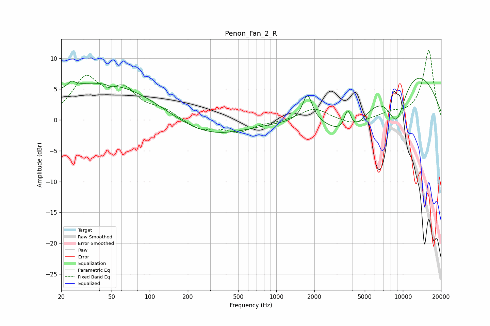

# Penon_Fan_2_R
See [usage instructions](https://github.com/jaakkopasanen/AutoEq#usage) for more options and info.

### Parametric EQs
Apply preamp of -6.9 dB when using parametric equalizer.

|   # | Type    |   Fc (Hz) |    Q |   Gain (dB) |
|-----|---------|-----------|------|-------------|
|   1 | Peaking |        24 | 5.25 |         0.9 |
|   2 | Peaking |        43 | 0.29 |         6.3 |
|   3 | Peaking |        50 | 5.23 |        -0.3 |
|   4 | Peaking |       271 | 0.46 |        -3.2 |
|   5 | Peaking |      1763 | 3.67 |         4.5 |
|   6 | Peaking |      3622 | 3.07 |         0.7 |
|   7 | Peaking |      3665 | 5.62 |         3   |
|   8 | Peaking |      3829 | 0.88 |        -6.8 |
|   9 | Peaking |      8912 | 1.63 |        -8   |
|  10 | Peaking |      9948 | 0.33 |         9.7 |

### Fixed Band EQs
When using fixed band (also called graphic) equalizer, apply preamp of **-11.4 dB** (if available) and set gains manually with these parameters.

|   # | Type    |   Fc (Hz) |    Q |   Gain (dB) |
|-----|---------|-----------|------|-------------|
|   1 | Peaking |        31 | 1.41 |         6.4 |
|   2 | Peaking |        62 | 1.41 |         4.2 |
|   3 | Peaking |       125 | 1.41 |         1.4 |
|   4 | Peaking |       250 | 1.41 |        -1.6 |
|   5 | Peaking |       500 | 1.41 |        -1.9 |
|   6 | Peaking |      1000 | 1.41 |        -0.3 |
|   7 | Peaking |      2000 | 1.41 |         1.9 |
|   8 | Peaking |      4000 | 1.41 |        -0.9 |
|   9 | Peaking |      8000 | 1.41 |         0.9 |
|  10 | Peaking |     16000 | 1.41 |        11.3 |

### Graphs

