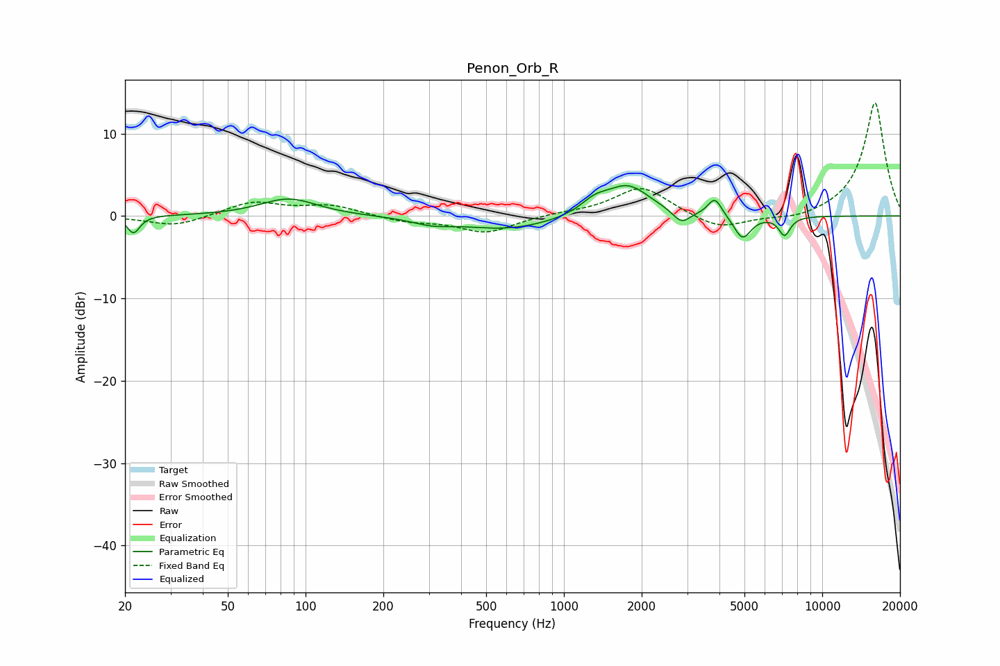

# Penon_Orb_R
See [usage instructions](https://github.com/jaakkopasanen/AutoEq#usage) for more options and info.

### Parametric EQs
Apply preamp of -3.8 dB when using parametric equalizer.

|   # | Type    |   Fc (Hz) |    Q |   Gain (dB) |
|-----|---------|-----------|------|-------------|
|   1 | Peaking |        22 | 5.99 |        -2.1 |
|   2 | Peaking |        86 | 1.29 |         2.1 |
|   3 | Peaking |       307 | 1.96 |        -0.6 |
|   4 | Peaking |       605 | 0.76 |        -1.7 |
|   5 | Peaking |      1312 | 2.67 |         1.3 |
|   6 | Peaking |      1766 | 1.61 |         3.7 |
|   7 | Peaking |      2850 | 4.19 |        -1.6 |
|   8 | Peaking |      3841 | 5.21 |         2.2 |
|   9 | Peaking |      4914 | 4.24 |        -2.9 |
|  10 | Peaking |      7149 | 6    |        -2.3 |

### Fixed Band EQs
When using fixed band (also called graphic) equalizer, apply preamp of **-13.8 dB** (if available) and set gains manually with these parameters.

|   # | Type    |   Fc (Hz) |    Q |   Gain (dB) |
|-----|---------|-----------|------|-------------|
|   1 | Peaking |        31 | 1.41 |        -1.3 |
|   2 | Peaking |        62 | 1.41 |         1.7 |
|   3 | Peaking |       125 | 1.41 |         1.2 |
|   4 | Peaking |       250 | 1.41 |        -0.7 |
|   5 | Peaking |       500 | 1.41 |        -2   |
|   6 | Peaking |      1000 | 1.41 |         0.3 |
|   7 | Peaking |      2000 | 1.41 |         3.6 |
|   8 | Peaking |      4000 | 1.41 |        -1.8 |
|   9 | Peaking |      8000 | 1.41 |        -0.6 |
|  10 | Peaking |     16000 | 1.41 |        13.9 |

### Graphs

