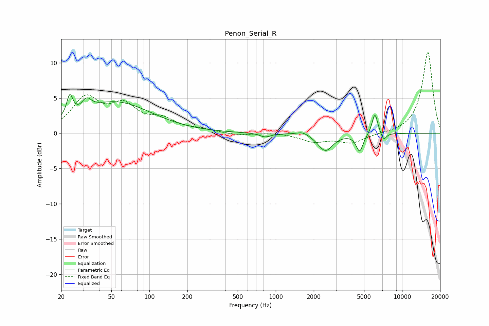

# Penon_Serial_R
See [usage instructions](https://github.com/jaakkopasanen/AutoEq#usage) for more options and info.

### Parametric EQs
Apply preamp of -5.6 dB when using parametric equalizer.

|   # | Type    |   Fc (Hz) |    Q |   Gain (dB) |
|-----|---------|-----------|------|-------------|
|   1 | Peaking |        23 | 5.94 |         3   |
|   2 | Peaking |        32 | 5.1  |         3.8 |
|   3 | Peaking |        32 | 6    |        -2.4 |
|   4 | Peaking |        54 | 0.5  |         4.4 |
|   5 | Peaking |       826 | 3.35 |        -0.5 |
|   6 | Peaking |      1636 | 3.04 |         0.5 |
|   7 | Peaking |      2471 | 2.42 |        -2.5 |
|   8 | Peaking |      4618 | 5.08 |        -2.5 |
|   9 | Peaking |      6097 | 5.94 |         3   |
|  10 | Peaking |      7148 | 6    |        -1.1 |

### Fixed Band EQs
When using fixed band (also called graphic) equalizer, apply preamp of **-11.6 dB** (if available) and set gains manually with these parameters.

|   # | Type    |   Fc (Hz) |    Q |   Gain (dB) |
|-----|---------|-----------|------|-------------|
|   1 | Peaking |        31 | 1.41 |         4.7 |
|   2 | Peaking |        62 | 1.41 |         3.4 |
|   3 | Peaking |       125 | 1.41 |         1.7 |
|   4 | Peaking |       250 | 1.41 |         0.4 |
|   5 | Peaking |       500 | 1.41 |        -0.3 |
|   6 | Peaking |      1000 | 1.41 |         0.1 |
|   7 | Peaking |      2000 | 1.41 |        -1.1 |
|   8 | Peaking |      4000 | 1.41 |        -1.3 |
|   9 | Peaking |      8000 | 1.41 |        -0.1 |
|  10 | Peaking |     16000 | 1.41 |        11.6 |

### Graphs

