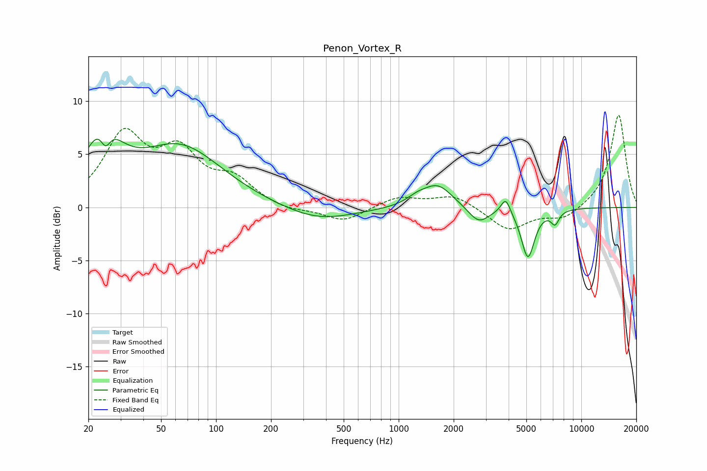

# Penon_Vortex_R
See [usage instructions](https://github.com/jaakkopasanen/AutoEq#usage) for more options and info.

### Parametric EQs
Apply preamp of -6.5 dB when using parametric equalizer.

|   # | Type    |   Fc (Hz) |    Q |   Gain (dB) |
|-----|---------|-----------|------|-------------|
|   1 | Peaking |        24 | 1.52 |         6   |
|   2 | Peaking |        25 | 5.03 |        -2.1 |
|   3 | Peaking |        64 | 0.62 |         5.6 |
|   4 | Peaking |       361 | 0.73 |        -1.3 |
|   5 | Peaking |      1256 | 2.51 |         0.6 |
|   6 | Peaking |      1636 | 1.74 |         2.1 |
|   7 | Peaking |      2743 | 2.46 |        -1.5 |
|   8 | Peaking |      3856 | 5.51 |         1.5 |
|   9 | Peaking |      5101 | 3.86 |        -4.7 |
|  10 | Peaking |      7180 | 6    |        -1.2 |

### Fixed Band EQs
When using fixed band (also called graphic) equalizer, apply preamp of **-8.8 dB** (if available) and set gains manually with these parameters.

|   # | Type    |   Fc (Hz) |    Q |   Gain (dB) |
|-----|---------|-----------|------|-------------|
|   1 | Peaking |        31 | 1.41 |         6.5 |
|   2 | Peaking |        62 | 1.41 |         4.6 |
|   3 | Peaking |       125 | 1.41 |         2.3 |
|   4 | Peaking |       250 | 1.41 |        -0.4 |
|   5 | Peaking |       500 | 1.41 |        -1.4 |
|   6 | Peaking |      1000 | 1.41 |         1   |
|   7 | Peaking |      2000 | 1.41 |         1.2 |
|   8 | Peaking |      4000 | 1.41 |        -2.2 |
|   9 | Peaking |      8000 | 1.41 |        -1.1 |
|  10 | Peaking |     16000 | 1.41 |         8.8 |

### Graphs

