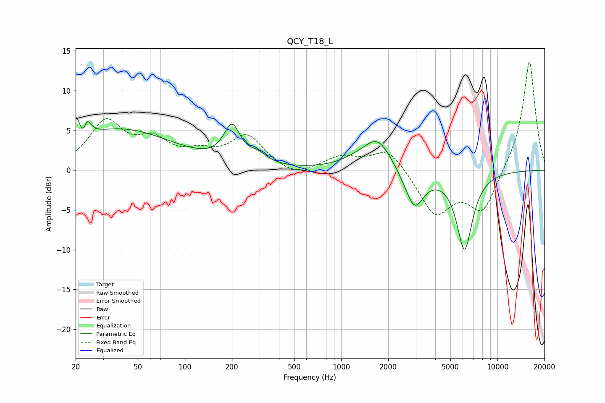

# QCY_T18_L
See [usage instructions](https://github.com/jaakkopasanen/AutoEq#usage) for more options and info.

### Parametric EQs
Apply preamp of -6.8 dB when using parametric equalizer.

|   # | Type    |   Fc (Hz) |    Q |   Gain (dB) |
|-----|---------|-----------|------|-------------|
|   1 | Peaking |        20 | 5.94 |         2.9 |
|   2 | Peaking |        23 | 5.96 |        -2.6 |
|   3 | Peaking |        23 | 5.73 |         3.3 |
|   4 | Peaking |        39 | 0.41 |         5.1 |
|   5 | Peaking |       200 | 2.72 |         4.5 |
|   6 | Peaking |       294 | 2.35 |         1.1 |
|   7 | Peaking |      1242 | 1.34 |         0.8 |
|   8 | Peaking |      1715 | 1.62 |         3.8 |
|   9 | Peaking |      2939 | 2.34 |        -4.8 |
|  10 | Peaking |      6158 | 2.69 |        -9.8 |

### Fixed Band EQs
When using fixed band (also called graphic) equalizer, apply preamp of **-13.7 dB** (if available) and set gains manually with these parameters.

|   # | Type    |   Fc (Hz) |    Q |   Gain (dB) |
|-----|---------|-----------|------|-------------|
|   1 | Peaking |        31 | 1.41 |         5.8 |
|   2 | Peaking |        62 | 1.41 |         3.1 |
|   3 | Peaking |       125 | 1.41 |         1.6 |
|   4 | Peaking |       250 | 1.41 |         4.1 |
|   5 | Peaking |       500 | 1.41 |        -1.1 |
|   6 | Peaking |      1000 | 1.41 |         1.6 |
|   7 | Peaking |      2000 | 1.41 |         2.9 |
|   8 | Peaking |      4000 | 1.41 |        -5.5 |
|   9 | Peaking |      8000 | 1.41 |        -5.2 |
|  10 | Peaking |     16000 | 1.41 |        14   |

### Graphs

