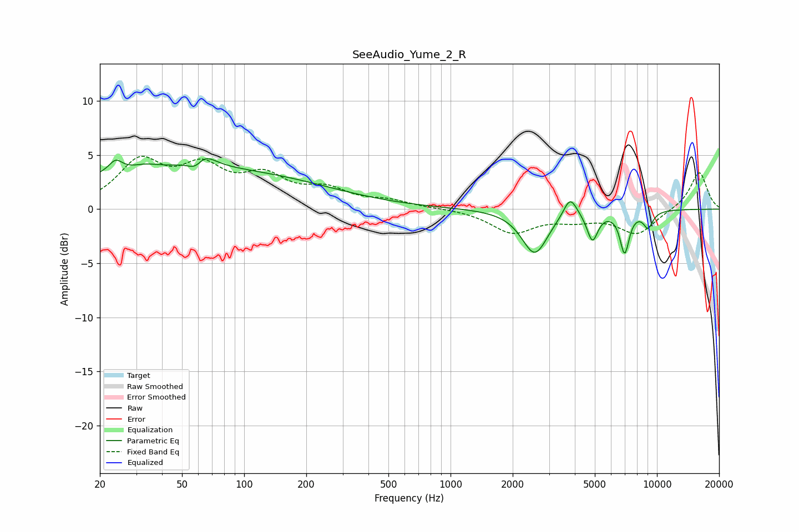

# SeeAudio_Yume_2_R
See [usage instructions](https://github.com/jaakkopasanen/AutoEq#usage) for more options and info.

### Parametric EQs
Apply preamp of -4.8 dB when using parametric equalizer.

|   # | Type    |   Fc (Hz) |    Q |   Gain (dB) |
|-----|---------|-----------|------|-------------|
|   1 | Peaking |        24 | 4.44 |         1.1 |
|   2 | Peaking |        33 | 2.44 |         0.4 |
|   3 | Peaking |        54 | 0.21 |         3.8 |
|   4 | Peaking |        59 | 3.15 |        -3.2 |
|   5 | Peaking |        61 | 2.65 |         3.6 |
|   6 | Peaking |      2558 | 2.26 |        -4.1 |
|   7 | Peaking |      3796 | 4.31 |         1.9 |
|   8 | Peaking |      4868 | 5.33 |        -2.7 |
|   9 | Peaking |      6970 | 6    |        -3.8 |
|  10 | Peaking |      9059 | 5.44 |        -1.5 |

### Fixed Band EQs
When using fixed band (also called graphic) equalizer, apply preamp of **-5.0 dB** (if available) and set gains manually with these parameters.

|   # | Type    |   Fc (Hz) |    Q |   Gain (dB) |
|-----|---------|-----------|------|-------------|
|   1 | Peaking |        31 | 1.41 |         4.1 |
|   2 | Peaking |        62 | 1.41 |         3.3 |
|   3 | Peaking |       125 | 1.41 |         2.6 |
|   4 | Peaking |       250 | 1.41 |         1.6 |
|   5 | Peaking |       500 | 1.41 |         0.7 |
|   6 | Peaking |      1000 | 1.41 |         0.1 |
|   7 | Peaking |      2000 | 1.41 |        -2.1 |
|   8 | Peaking |      4000 | 1.41 |        -0.8 |
|   9 | Peaking |      8000 | 1.41 |        -2.3 |
|  10 | Peaking |     16000 | 1.41 |         3.5 |

### Graphs

