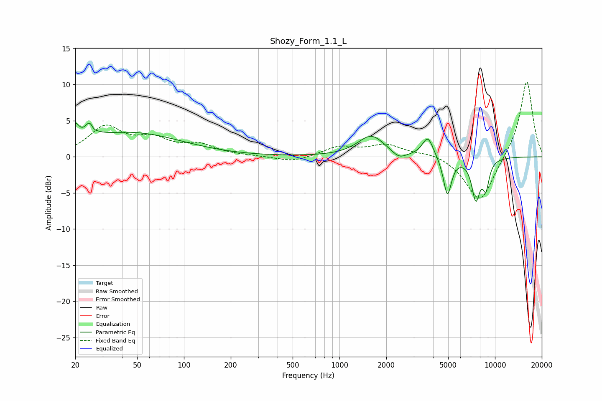

# Shozy_Form_1.1_L
See [usage instructions](https://github.com/jaakkopasanen/AutoEq#usage) for more options and info.

### Parametric EQs
Apply preamp of -4.8 dB when using parametric equalizer.

|   # | Type    |   Fc (Hz) |    Q |   Gain (dB) |
|-----|---------|-----------|------|-------------|
|   1 | Peaking |        20 | 5.92 |         2.2 |
|   2 | Peaking |        25 | 4.76 |         3.5 |
|   3 | Peaking |        26 | 6    |        -2   |
|   4 | Peaking |        45 | 0.43 |         3.3 |
|   5 | Peaking |      1602 | 1.63 |         2.9 |
|   6 | Peaking |      2414 | 3.06 |        -1   |
|   7 | Peaking |      3702 | 3.94 |         2.8 |
|   8 | Peaking |      4945 | 5.33 |        -5.3 |
|   9 | Peaking |      7532 | 4.92 |        -5.5 |
|  10 | Peaking |      8746 | 6    |        -3.6 |

### Fixed Band EQs
When using fixed band (also called graphic) equalizer, apply preamp of **-10.5 dB** (if available) and set gains manually with these parameters.

|   # | Type    |   Fc (Hz) |    Q |   Gain (dB) |
|-----|---------|-----------|------|-------------|
|   1 | Peaking |        31 | 1.41 |         3.9 |
|   2 | Peaking |        62 | 1.41 |         2.1 |
|   3 | Peaking |       125 | 1.41 |         1.5 |
|   4 | Peaking |       250 | 1.41 |         0.1 |
|   5 | Peaking |       500 | 1.41 |        -0.8 |
|   6 | Peaking |      1000 | 1.41 |         1.3 |
|   7 | Peaking |      2000 | 1.41 |         1.6 |
|   8 | Peaking |      4000 | 1.41 |         0.6 |
|   9 | Peaking |      8000 | 1.41 |        -6.5 |
|  10 | Peaking |     16000 | 1.41 |        10.7 |

### Graphs

