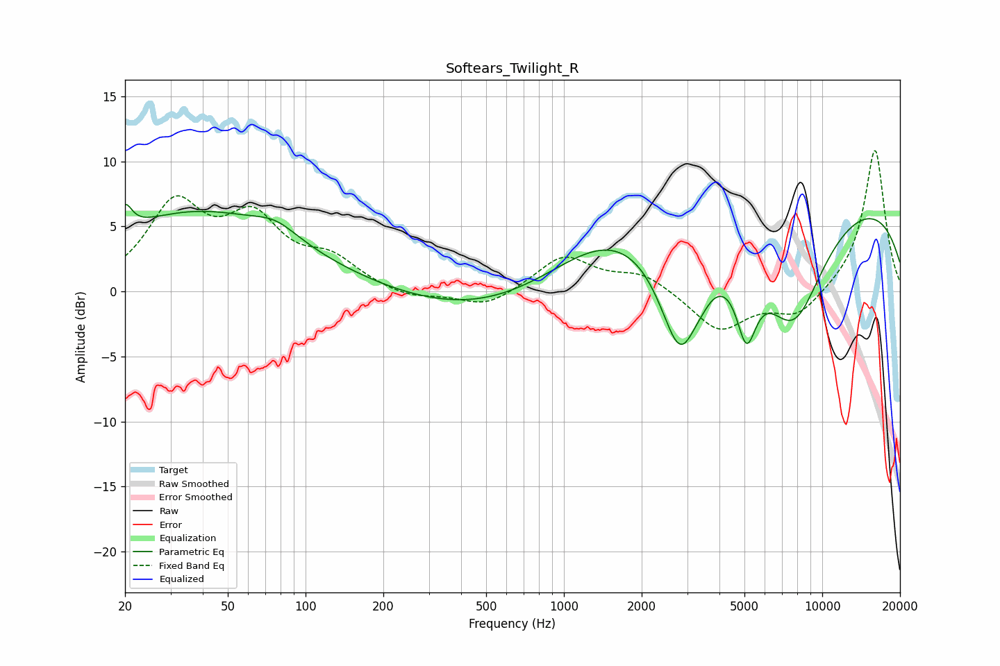

# Softears_Twilight_R
See [usage instructions](https://github.com/jaakkopasanen/AutoEq#usage) for more options and info.

### Parametric EQs
Apply preamp of -6.8 dB when using parametric equalizer.

|   # | Type    |   Fc (Hz) |    Q |   Gain (dB) |
|-----|---------|-----------|------|-------------|
|   1 | Peaking |        20 | 5.45 |         2   |
|   2 | Peaking |        38 | 0.37 |         6   |
|   3 | Peaking |        77 | 1.69 |         1.1 |
|   4 | Peaking |       470 | 0.45 |        -1.8 |
|   5 | Peaking |      1487 | 0.64 |         2.8 |
|   6 | Peaking |      2826 | 1.65 |        -9.5 |
|   7 | Peaking |      3460 | 5.6  |        -0.2 |
|   8 | Peaking |      5090 | 3.55 |        -5.3 |
|   9 | Peaking |      7716 | 1.01 |        -9.3 |
|  10 | Peaking |      9055 | 0.18 |         8   |

### Fixed Band EQs
When using fixed band (also called graphic) equalizer, apply preamp of **-10.9 dB** (if available) and set gains manually with these parameters.

|   # | Type    |   Fc (Hz) |    Q |   Gain (dB) |
|-----|---------|-----------|------|-------------|
|   1 | Peaking |        31 | 1.41 |         6.3 |
|   2 | Peaking |        62 | 1.41 |         4.9 |
|   3 | Peaking |       125 | 1.41 |         2.1 |
|   4 | Peaking |       250 | 1.41 |        -0.6 |
|   5 | Peaking |       500 | 1.41 |        -1.3 |
|   6 | Peaking |      1000 | 1.41 |         2.7 |
|   7 | Peaking |      2000 | 1.41 |         1.4 |
|   8 | Peaking |      4000 | 1.41 |        -3.1 |
|   9 | Peaking |      8000 | 1.41 |        -1.9 |
|  10 | Peaking |     16000 | 1.41 |        11   |

### Graphs

