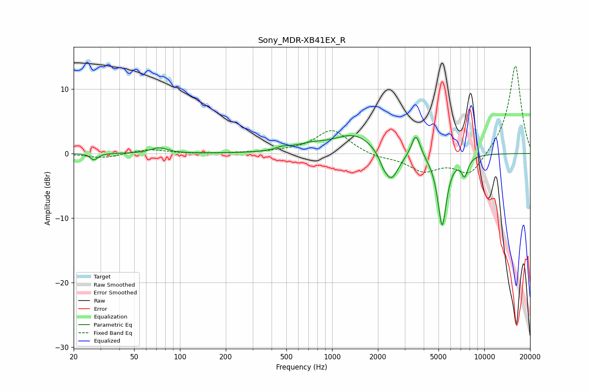

# Sony_MDR-XB41EX_R
See [usage instructions](https://github.com/jaakkopasanen/AutoEq#usage) for more options and info.

### Parametric EQs
Apply preamp of -2.9 dB when using parametric equalizer.

|   # | Type    |   Fc (Hz) |    Q |   Gain (dB) |
|-----|---------|-----------|------|-------------|
|   1 | Peaking |        27 | 6    |        -1   |
|   2 | Peaking |        73 | 2.61 |         0.9 |
|   3 | Peaking |       472 | 3.37 |         0.4 |
|   4 | Peaking |       710 | 1.37 |         0.9 |
|   5 | Peaking |      1418 | 1.03 |         3   |
|   6 | Peaking |      2166 | 6    |        -0.7 |
|   7 | Peaking |      2437 | 2.78 |        -4.8 |
|   8 | Peaking |      3553 | 4.84 |         3.7 |
|   9 | Peaking |      5285 | 4.63 |       -11.2 |
|  10 | Peaking |      7427 | 6    |        -2.8 |

### Fixed Band EQs
When using fixed band (also called graphic) equalizer, apply preamp of **-13.7 dB** (if available) and set gains manually with these parameters.

|   # | Type    |   Fc (Hz) |    Q |   Gain (dB) |
|-----|---------|-----------|------|-------------|
|   1 | Peaking |        31 | 1.41 |        -0.7 |
|   2 | Peaking |        62 | 1.41 |         0.7 |
|   3 | Peaking |       125 | 1.41 |        -0.1 |
|   4 | Peaking |       250 | 1.41 |         0.1 |
|   5 | Peaking |       500 | 1.41 |         0.2 |
|   6 | Peaking |      1000 | 1.41 |         3.7 |
|   7 | Peaking |      2000 | 1.41 |        -0.6 |
|   8 | Peaking |      4000 | 1.41 |        -2.6 |
|   9 | Peaking |      8000 | 1.41 |        -3.5 |
|  10 | Peaking |     16000 | 1.41 |        13.9 |

### Graphs

