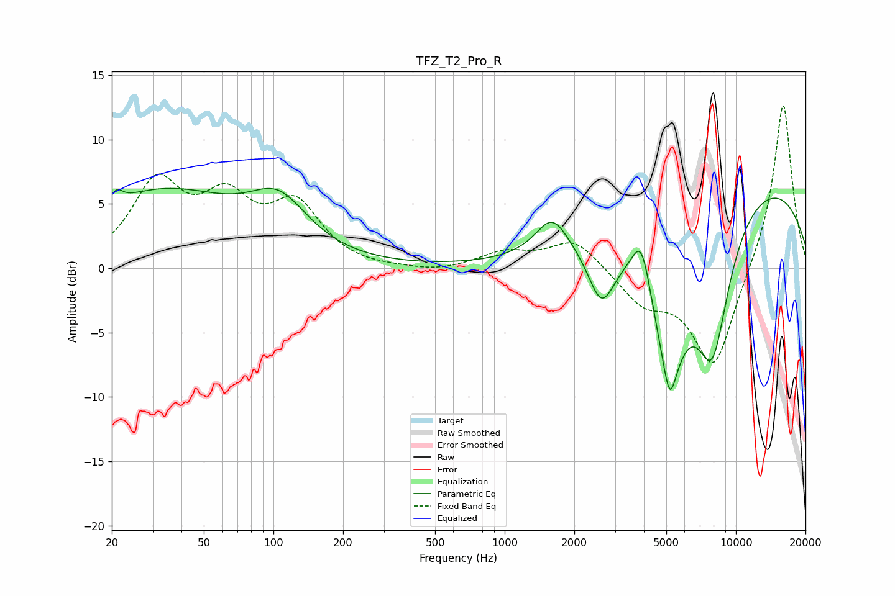

# TFZ_T2_Pro_R
See [usage instructions](https://github.com/jaakkopasanen/AutoEq#usage) for more options and info.

### Parametric EQs
Apply preamp of -6.3 dB when using parametric equalizer.

|   # | Type    |   Fc (Hz) |    Q |   Gain (dB) |
|-----|---------|-----------|------|-------------|
|   1 | Peaking |        21 | 5.72 |         0.9 |
|   2 | Peaking |        33 | 0.42 |         5.8 |
|   3 | Peaking |       105 | 1.13 |         3.7 |
|   4 | Peaking |      1602 | 2.03 |         2.9 |
|   5 | Peaking |      2624 | 2.41 |        -4.5 |
|   6 | Peaking |      3905 | 3.5  |         3.9 |
|   7 | Peaking |      5125 | 1.55 |       -10.7 |
|   8 | Peaking |      5181 | 5.92 |        -2.3 |
|   9 | Peaking |      7915 | 1.65 |       -11.1 |
|  10 | Peaking |     10000 | 0.23 |         7.5 |

### Fixed Band EQs
When using fixed band (also called graphic) equalizer, apply preamp of **-12.8 dB** (if available) and set gains manually with these parameters.

|   # | Type    |   Fc (Hz) |    Q |   Gain (dB) |
|-----|---------|-----------|------|-------------|
|   1 | Peaking |        31 | 1.41 |         6.3 |
|   2 | Peaking |        62 | 1.41 |         4.5 |
|   3 | Peaking |       125 | 1.41 |         4.5 |
|   4 | Peaking |       250 | 1.41 |        -0.1 |
|   5 | Peaking |       500 | 1.41 |        -0.4 |
|   6 | Peaking |      1000 | 1.41 |         1.2 |
|   7 | Peaking |      2000 | 1.41 |         2.3 |
|   8 | Peaking |      4000 | 1.41 |        -2.5 |
|   9 | Peaking |      8000 | 1.41 |        -7.9 |
|  10 | Peaking |     16000 | 1.41 |        13.2 |

### Graphs

