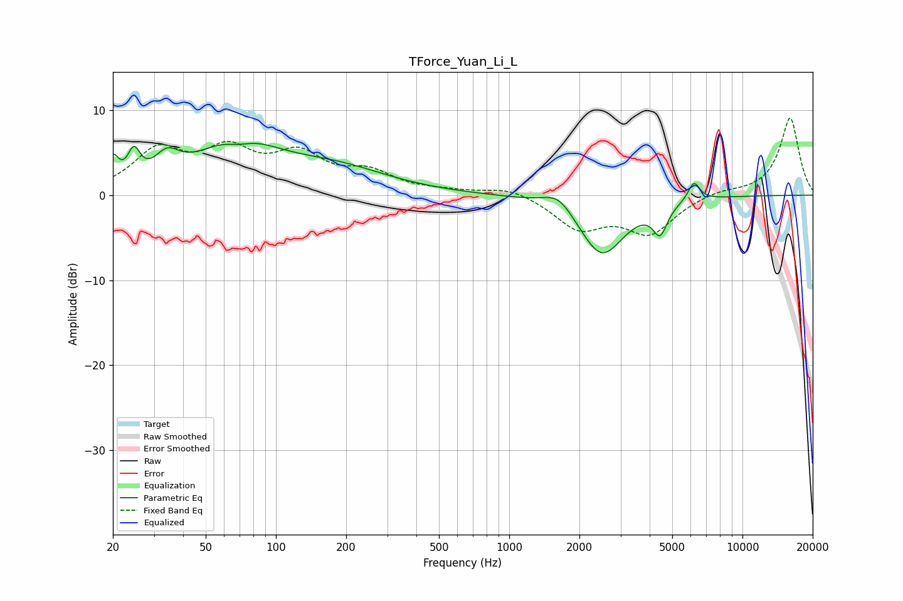

# TForce_Yuan_Li_L
See [usage instructions](https://github.com/jaakkopasanen/AutoEq#usage) for more options and info.

### Parametric EQs
Apply preamp of -6.2 dB when using parametric equalizer.

|   # | Type    |   Fc (Hz) |    Q |   Gain (dB) |
|-----|---------|-----------|------|-------------|
|   1 | Peaking |        20 | 5.88 |         3.1 |
|   2 | Peaking |        25 | 5.41 |         3.3 |
|   3 | Peaking |        34 | 2.65 |         2.7 |
|   4 | Peaking |        68 | 0.86 |         6.1 |
|   5 | Peaking |        69 | 2.16 |        -1.3 |
|   6 | Peaking |       179 | 0.61 |         2.8 |
|   7 | Peaking |      1629 | 2.16 |         2   |
|   8 | Peaking |      2492 | 1.43 |        -7.2 |
|   9 | Peaking |      4436 | 4.69 |        -3.3 |
|  10 | Peaking |      6191 | 5.43 |         2.3 |

### Fixed Band EQs
When using fixed band (also called graphic) equalizer, apply preamp of **-9.1 dB** (if available) and set gains manually with these parameters.

|   # | Type    |   Fc (Hz) |    Q |   Gain (dB) |
|-----|---------|-----------|------|-------------|
|   1 | Peaking |        31 | 1.41 |         4.9 |
|   2 | Peaking |        62 | 1.41 |         4.5 |
|   3 | Peaking |       125 | 1.41 |         4.2 |
|   4 | Peaking |       250 | 1.41 |         2.3 |
|   5 | Peaking |       500 | 1.41 |         0.3 |
|   6 | Peaking |      1000 | 1.41 |         1   |
|   7 | Peaking |      2000 | 1.41 |        -3.7 |
|   8 | Peaking |      4000 | 1.41 |        -4.3 |
|   9 | Peaking |      8000 | 1.41 |         0.6 |
|  10 | Peaking |     16000 | 1.41 |         9.1 |

### Graphs

