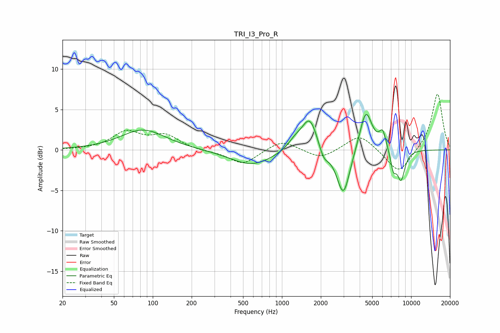

# TRI_I3_Pro_R
See [usage instructions](https://github.com/jaakkopasanen/AutoEq#usage) for more options and info.

### Parametric EQs
Apply preamp of -4.5 dB when using parametric equalizer.

|   # | Type    |   Fc (Hz) |    Q |   Gain (dB) |
|-----|---------|-----------|------|-------------|
|   1 | Peaking |        84 | 0.82 |         2.5 |
|   2 | Peaking |       582 | 0.88 |        -1.9 |
|   3 | Peaking |      1263 | 2.57 |         1   |
|   4 | Peaking |      1644 | 2.29 |         4.2 |
|   5 | Peaking |      2103 | 3.68 |        -1.6 |
|   6 | Peaking |      2990 | 2.76 |        -5.9 |
|   7 | Peaking |      4463 | 2.87 |         5.2 |
|   8 | Peaking |      6026 | 5.13 |         2.1 |
|   9 | Peaking |      7286 | 5.96 |        -2.2 |
|  10 | Peaking |      8352 | 4.24 |        -3.6 |

### Fixed Band EQs
When using fixed band (also called graphic) equalizer, apply preamp of **-7.0 dB** (if available) and set gains manually with these parameters.

|   # | Type    |   Fc (Hz) |    Q |   Gain (dB) |
|-----|---------|-----------|------|-------------|
|   1 | Peaking |        31 | 1.41 |         0   |
|   2 | Peaking |        62 | 1.41 |         2.1 |
|   3 | Peaking |       125 | 1.41 |         1.7 |
|   4 | Peaking |       250 | 1.41 |        -0.2 |
|   5 | Peaking |       500 | 1.41 |        -1.8 |
|   6 | Peaking |      1000 | 1.41 |         1.3 |
|   7 | Peaking |      2000 | 1.41 |        -1.2 |
|   8 | Peaking |      4000 | 1.41 |         2   |
|   9 | Peaking |      8000 | 1.41 |        -3   |
|  10 | Peaking |     16000 | 1.41 |         7   |

### Graphs

