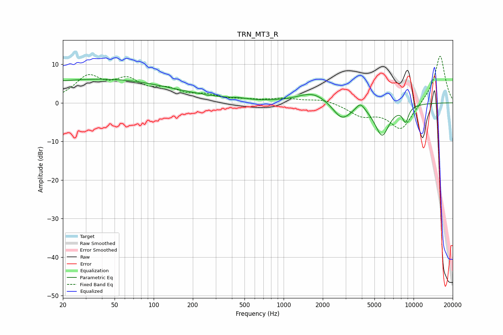

# TRN_MT3_R
See [usage instructions](https://github.com/jaakkopasanen/AutoEq#usage) for more options and info.

### Parametric EQs
Apply preamp of -6.2 dB when using parametric equalizer.

|   # | Type    |   Fc (Hz) |    Q |   Gain (dB) |
|-----|---------|-----------|------|-------------|
|   1 | Peaking |        20 | 0.19 |         5.1 |
|   2 | Peaking |        92 | 0.32 |         1.9 |
|   3 | Peaking |       259 | 5.82 |        -3.3 |
|   4 | Peaking |       259 | 5.66 |         3.2 |
|   5 | Peaking |       451 | 2.04 |         0.4 |
|   6 | Peaking |      1692 | 1.22 |         2.9 |
|   7 | Peaking |      2807 | 2    |        -4.4 |
|   8 | Peaking |      3902 | 4.18 |         2.2 |
|   9 | Peaking |      5725 | 2.42 |        -8.2 |
|  10 | Peaking |      8674 | 5.48 |        -3.8 |

### Fixed Band EQs
When using fixed band (also called graphic) equalizer, apply preamp of **-12.2 dB** (if available) and set gains manually with these parameters.

|   # | Type    |   Fc (Hz) |    Q |   Gain (dB) |
|-----|---------|-----------|------|-------------|
|   1 | Peaking |        31 | 1.41 |         6.2 |
|   2 | Peaking |        62 | 1.41 |         5   |
|   3 | Peaking |       125 | 1.41 |         2.7 |
|   4 | Peaking |       250 | 1.41 |         1.6 |
|   5 | Peaking |       500 | 1.41 |         0.5 |
|   6 | Peaking |      1000 | 1.41 |         1   |
|   7 | Peaking |      2000 | 1.41 |         1   |
|   8 | Peaking |      4000 | 1.41 |        -3   |
|   9 | Peaking |      8000 | 1.41 |        -7   |
|  10 | Peaking |     16000 | 1.41 |        12.6 |

### Graphs

