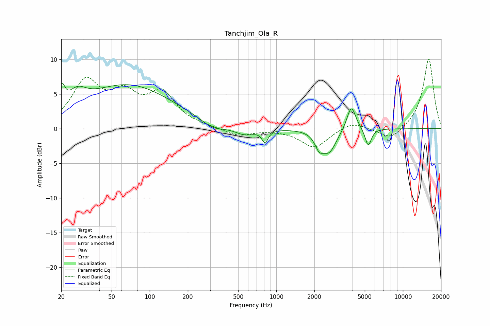

# Tanchjim_Ola_R
See [usage instructions](https://github.com/jaakkopasanen/AutoEq#usage) for more options and info.

### Parametric EQs
Apply preamp of -6.7 dB when using parametric equalizer.

|   # | Type    |   Fc (Hz) |    Q |   Gain (dB) |
|-----|---------|-----------|------|-------------|
|   1 | Peaking |        20 | 6    |         3   |
|   2 | Peaking |        27 | 2.01 |         2.2 |
|   3 | Peaking |        67 | 0.4  |         6.2 |
|   4 | Peaking |       314 | 1.55 |        -1.1 |
|   5 | Peaking |       564 | 1.72 |        -1.1 |
|   6 | Peaking |       814 | 5.96 |        -1.7 |
|   7 | Peaking |      2181 | 4.26 |        -1.8 |
|   8 | Peaking |      2620 | 2.52 |        -3.2 |
|   9 | Peaking |      3914 | 3.97 |         3.6 |
|  10 | Peaking |      5324 | 5.78 |        -2.6 |

### Fixed Band EQs
When using fixed band (also called graphic) equalizer, apply preamp of **-10.1 dB** (if available) and set gains manually with these parameters.

|   # | Type    |   Fc (Hz) |    Q |   Gain (dB) |
|-----|---------|-----------|------|-------------|
|   1 | Peaking |        31 | 1.41 |         6.5 |
|   2 | Peaking |        62 | 1.41 |         4.1 |
|   3 | Peaking |       125 | 1.41 |         4.7 |
|   4 | Peaking |       250 | 1.41 |         0.2 |
|   5 | Peaking |       500 | 1.41 |        -1.1 |
|   6 | Peaking |      1000 | 1.41 |        -0.1 |
|   7 | Peaking |      2000 | 1.41 |        -2.8 |
|   8 | Peaking |      4000 | 1.41 |         1.1 |
|   9 | Peaking |      8000 | 1.41 |        -1.7 |
|  10 | Peaking |     16000 | 1.41 |        10.2 |

### Graphs

