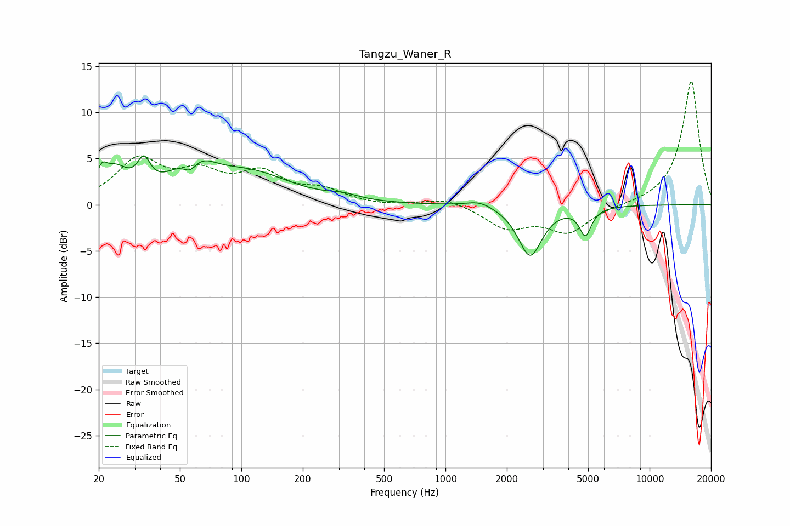

# Tangzu_Waner_R
See [usage instructions](https://github.com/jaakkopasanen/AutoEq#usage) for more options and info.

### Parametric EQs
Apply preamp of -5.4 dB when using parametric equalizer.

|   # | Type    |   Fc (Hz) |    Q |   Gain (dB) |
|-----|---------|-----------|------|-------------|
|   1 | Peaking |        21 | 5.9  |         1.8 |
|   2 | Peaking |        24 | 2.16 |         3   |
|   3 | Peaking |        33 | 4.6  |         2.8 |
|   4 | Peaking |        56 | 3.45 |        -2.3 |
|   5 | Peaking |        57 | 1.56 |         4.4 |
|   6 | Peaking |       111 | 0.71 |         3.1 |
|   7 | Peaking |       314 | 1.87 |         0.5 |
|   8 | Peaking |      1474 | 2.2  |         0.7 |
|   9 | Peaking |      2598 | 2.45 |        -5.5 |
|  10 | Peaking |      4852 | 4.89 |        -3   |

### Fixed Band EQs
When using fixed band (also called graphic) equalizer, apply preamp of **-13.5 dB** (if available) and set gains manually with these parameters.

|   # | Type    |   Fc (Hz) |    Q |   Gain (dB) |
|-----|---------|-----------|------|-------------|
|   1 | Peaking |        31 | 1.41 |         4.6 |
|   2 | Peaking |        62 | 1.41 |         2.8 |
|   3 | Peaking |       125 | 1.41 |         3   |
|   4 | Peaking |       250 | 1.41 |         1.4 |
|   5 | Peaking |       500 | 1.41 |        -0.2 |
|   6 | Peaking |      1000 | 1.41 |         0.8 |
|   7 | Peaking |      2000 | 1.41 |        -2.4 |
|   8 | Peaking |      4000 | 1.41 |        -2.9 |
|   9 | Peaking |      8000 | 1.41 |        -0.1 |
|  10 | Peaking |     16000 | 1.41 |        13.5 |

### Graphs

