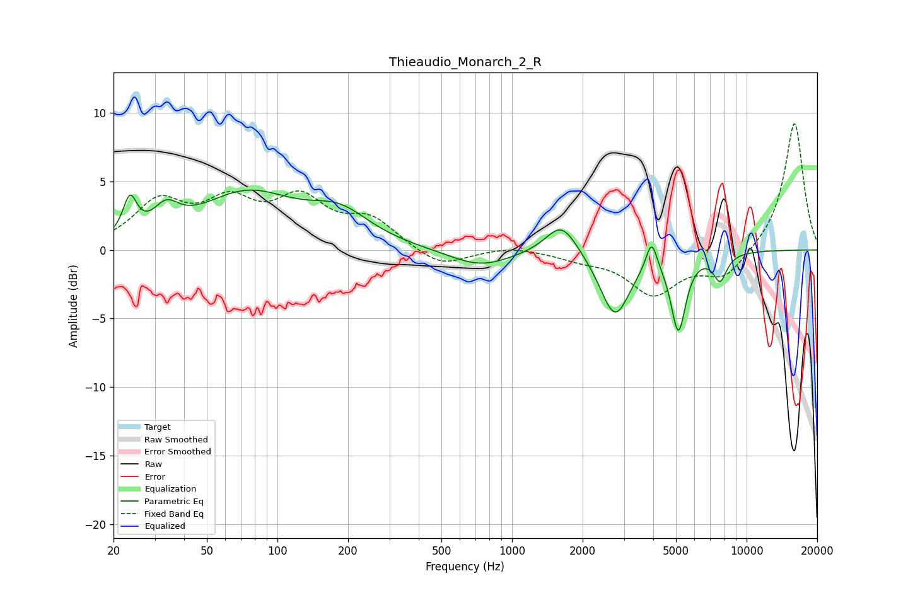

# Thieaudio_Monarch_2_R
See [usage instructions](https://github.com/jaakkopasanen/AutoEq#usage) for more options and info.

### Parametric EQs
Apply preamp of -4.5 dB when using parametric equalizer.

|   # | Type    |   Fc (Hz) |    Q |   Gain (dB) |
|-----|---------|-----------|------|-------------|
|   1 | Peaking |        23 | 4.88 |         2.7 |
|   2 | Peaking |        34 | 2.65 |         1.7 |
|   3 | Peaking |        74 | 0.68 |         3.9 |
|   4 | Peaking |       185 | 1.1  |         2.1 |
|   5 | Peaking |       731 | 1.07 |        -1.3 |
|   6 | Peaking |      1628 | 2.1  |         2.4 |
|   7 | Peaking |      2748 | 2.22 |        -4.8 |
|   8 | Peaking |      3935 | 6    |         2.2 |
|   9 | Peaking |      5120 | 4.46 |        -5.5 |
|  10 | Peaking |      7713 | 4.63 |        -1.9 |

### Fixed Band EQs
When using fixed band (also called graphic) equalizer, apply preamp of **-9.3 dB** (if available) and set gains manually with these parameters.

|   # | Type    |   Fc (Hz) |    Q |   Gain (dB) |
|-----|---------|-----------|------|-------------|
|   1 | Peaking |        31 | 1.41 |         3.3 |
|   2 | Peaking |        62 | 1.41 |         3   |
|   3 | Peaking |       125 | 1.41 |         3.3 |
|   4 | Peaking |       250 | 1.41 |         2   |
|   5 | Peaking |       500 | 1.41 |        -1.3 |
|   6 | Peaking |      1000 | 1.41 |         0.3 |
|   7 | Peaking |      2000 | 1.41 |        -0.5 |
|   8 | Peaking |      4000 | 1.41 |        -3.1 |
|   9 | Peaking |      8000 | 1.41 |        -2   |
|  10 | Peaking |     16000 | 1.41 |         9.4 |

### Graphs

