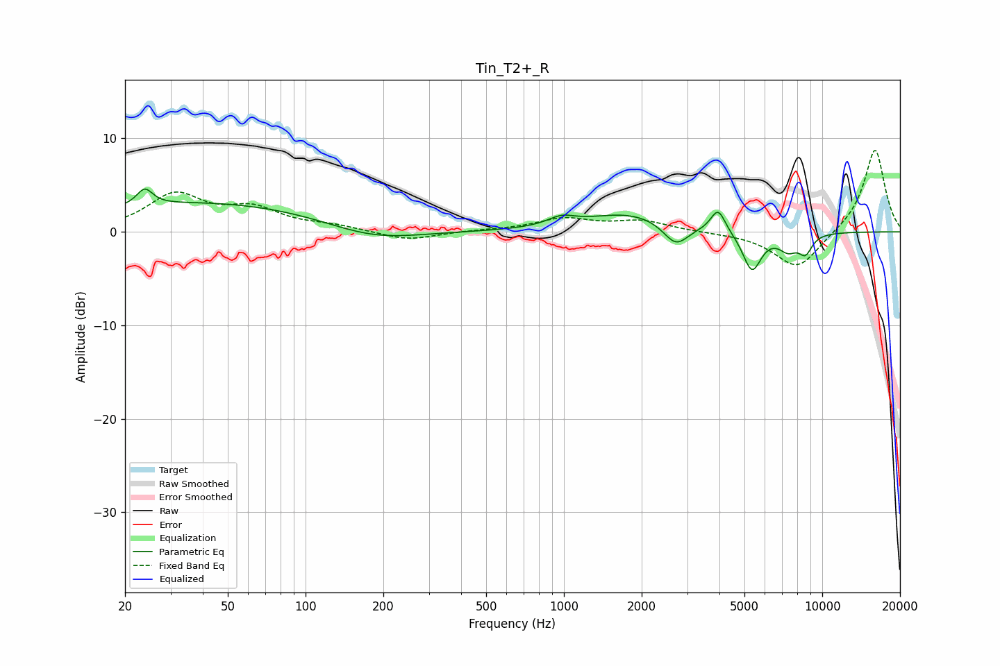

# Tin_T2+_R
See [usage instructions](https://github.com/jaakkopasanen/AutoEq#usage) for more options and info.

### Parametric EQs
Apply preamp of -4.7 dB when using parametric equalizer.

|   # | Type    |   Fc (Hz) |    Q |   Gain (dB) |
|-----|---------|-----------|------|-------------|
|   1 | Peaking |        24 | 4.7  |         1.8 |
|   2 | Peaking |        42 | 0.28 |         3.2 |
|   3 | Peaking |       180 | 0.76 |        -1.6 |
|   4 | Peaking |       978 | 2.68 |         0.9 |
|   5 | Peaking |      1812 | 0.82 |         2   |
|   6 | Peaking |      2712 | 2.87 |        -2.4 |
|   7 | Peaking |      3953 | 4.98 |         2.5 |
|   8 | Peaking |      5347 | 3.86 |        -4.2 |
|   9 | Peaking |      7383 | 3.55 |        -1.7 |
|  10 | Peaking |      8611 | 5    |        -1.9 |

### Fixed Band EQs
When using fixed band (also called graphic) equalizer, apply preamp of **-8.8 dB** (if available) and set gains manually with these parameters.

|   # | Type    |   Fc (Hz) |    Q |   Gain (dB) |
|-----|---------|-----------|------|-------------|
|   1 | Peaking |        31 | 1.41 |         3.8 |
|   2 | Peaking |        62 | 1.41 |         2.2 |
|   3 | Peaking |       125 | 1.41 |         0.5 |
|   4 | Peaking |       250 | 1.41 |        -1   |
|   5 | Peaking |       500 | 1.41 |         0.1 |
|   6 | Peaking |      1000 | 1.41 |         1.3 |
|   7 | Peaking |      2000 | 1.41 |         1.1 |
|   8 | Peaking |      4000 | 1.41 |        -0.1 |
|   9 | Peaking |      8000 | 1.41 |        -4   |
|  10 | Peaking |     16000 | 1.41 |         9   |

### Graphs

