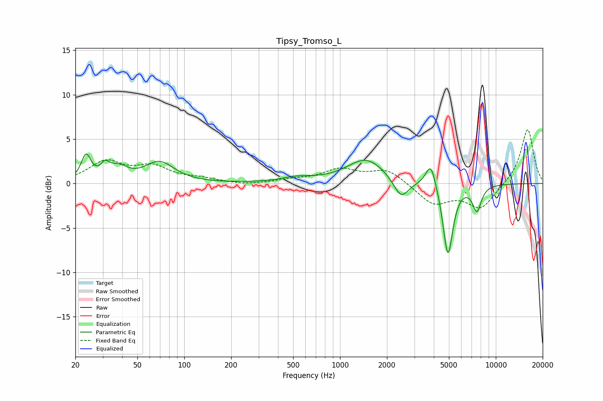

# Tipsy_Tromso_L
See [usage instructions](https://github.com/jaakkopasanen/AutoEq#usage) for more options and info.

### Parametric EQs
Apply preamp of -3.4 dB when using parametric equalizer.

|   # | Type    |   Fc (Hz) |    Q |   Gain (dB) |
|-----|---------|-----------|------|-------------|
|   1 | Peaking |        23 | 4.65 |         2.8 |
|   2 | Peaking |        31 | 5.21 |         1.2 |
|   3 | Peaking |        38 | 2.41 |         1.4 |
|   4 | Peaking |        69 | 1.51 |         2.3 |
|   5 | Peaking |       529 | 1.41 |         0.5 |
|   6 | Peaking |      1475 | 1.14 |         2.8 |
|   7 | Peaking |      2464 | 2.89 |        -2.3 |
|   8 | Peaking |      3831 | 4.38 |         2.9 |
|   9 | Peaking |      4930 | 4.42 |        -8.2 |
|  10 | Peaking |      7567 | 4.79 |        -2.8 |

### Fixed Band EQs
When using fixed band (also called graphic) equalizer, apply preamp of **-6.1 dB** (if available) and set gains manually with these parameters.

|   # | Type    |   Fc (Hz) |    Q |   Gain (dB) |
|-----|---------|-----------|------|-------------|
|   1 | Peaking |        31 | 1.41 |         2.3 |
|   2 | Peaking |        62 | 1.41 |         1.7 |
|   3 | Peaking |       125 | 1.41 |         0.4 |
|   4 | Peaking |       250 | 1.41 |        -0.2 |
|   5 | Peaking |       500 | 1.41 |         0.4 |
|   6 | Peaking |      1000 | 1.41 |         1.5 |
|   7 | Peaking |      2000 | 1.41 |         1.6 |
|   8 | Peaking |      4000 | 1.41 |        -2.3 |
|   9 | Peaking |      8000 | 1.41 |        -2.8 |
|  10 | Peaking |     16000 | 1.41 |         6.2 |

### Graphs

