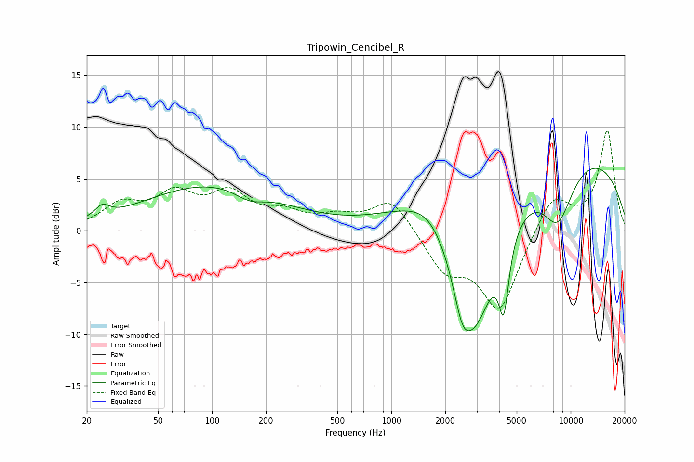

# Tripowin_Cencibel_R
See [usage instructions](https://github.com/jaakkopasanen/AutoEq#usage) for more options and info.

### Parametric EQs
Apply preamp of -6.1 dB when using parametric equalizer.

|   # | Type    |   Fc (Hz) |    Q |   Gain (dB) |
|-----|---------|-----------|------|-------------|
|   1 | Peaking |        24 | 3.6  |         1.1 |
|   2 | Peaking |       100 | 0.37 |         4.4 |
|   3 | Peaking |       162 | 1.7  |        -1   |
|   4 | Peaking |      1104 | 0.75 |         1.1 |
|   5 | Peaking |      1636 | 1.15 |         2.5 |
|   6 | Peaking |      2486 | 2.85 |        -3.8 |
|   7 | Peaking |      2955 | 1.05 |       -13   |
|   8 | Peaking |      4238 | 4.98 |        -6.6 |
|   9 | Peaking |      8482 | 1.46 |        -5.7 |
|  10 | Peaking |      8852 | 0.23 |         8.2 |

### Fixed Band EQs
When using fixed band (also called graphic) equalizer, apply preamp of **-9.7 dB** (if available) and set gains manually with these parameters.

|   # | Type    |   Fc (Hz) |    Q |   Gain (dB) |
|-----|---------|-----------|------|-------------|
|   1 | Peaking |        31 | 1.41 |         2.3 |
|   2 | Peaking |        62 | 1.41 |         3.1 |
|   3 | Peaking |       125 | 1.41 |         3.2 |
|   4 | Peaking |       250 | 1.41 |         1.4 |
|   5 | Peaking |       500 | 1.41 |         1.1 |
|   6 | Peaking |      1000 | 1.41 |         3.2 |
|   7 | Peaking |      2000 | 1.41 |        -3.6 |
|   8 | Peaking |      4000 | 1.41 |        -7.6 |
|   9 | Peaking |      8000 | 1.41 |         3.6 |
|  10 | Peaking |     16000 | 1.41 |         9.6 |

### Graphs

