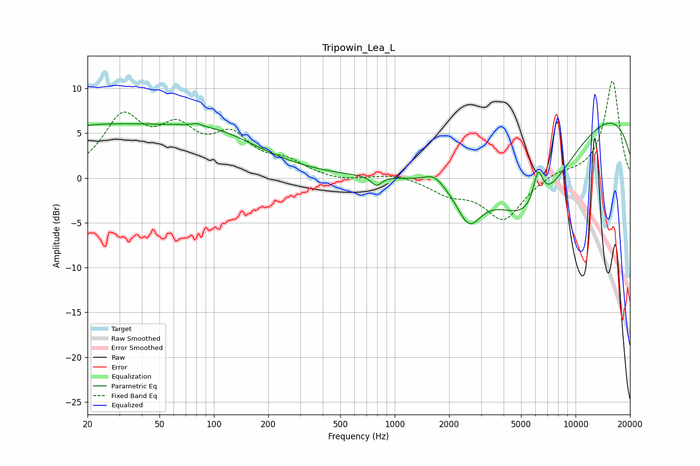

# Tripowin_Lea_L
See [usage instructions](https://github.com/jaakkopasanen/AutoEq#usage) for more options and info.

### Parametric EQs
Apply preamp of -6.2 dB when using parametric equalizer.

|   # | Type    |   Fc (Hz) |    Q |   Gain (dB) |
|-----|---------|-----------|------|-------------|
|   1 | Peaking |        20 | 0.29 |         5.4 |
|   2 | Peaking |        77 | 4.12 |        -0.4 |
|   3 | Peaking |        79 | 4.67 |         0.6 |
|   4 | Peaking |       105 | 0.53 |         3.6 |
|   5 | Peaking |       791 | 5.09 |        -1.1 |
|   6 | Peaking |      1653 | 2.71 |         1.1 |
|   7 | Peaking |      2573 | 2.11 |        -4.2 |
|   8 | Peaking |      5618 | 0.53 |       -12.2 |
|   9 | Peaking |      6206 | 5.11 |         3.8 |
|  10 | Peaking |     10000 | 0.22 |         9.8 |

### Fixed Band EQs
When using fixed band (also called graphic) equalizer, apply preamp of **-10.9 dB** (if available) and set gains manually with these parameters.

|   # | Type    |   Fc (Hz) |    Q |   Gain (dB) |
|-----|---------|-----------|------|-------------|
|   1 | Peaking |        31 | 1.41 |         6.3 |
|   2 | Peaking |        62 | 1.41 |         4.5 |
|   3 | Peaking |       125 | 1.41 |         4.1 |
|   4 | Peaking |       250 | 1.41 |         1.5 |
|   5 | Peaking |       500 | 1.41 |        -0.4 |
|   6 | Peaking |      1000 | 1.41 |         0.5 |
|   7 | Peaking |      2000 | 1.41 |        -1.5 |
|   8 | Peaking |      4000 | 1.41 |        -4.6 |
|   9 | Peaking |      8000 | 1.41 |         0.6 |
|  10 | Peaking |     16000 | 1.41 |        10.9 |

### Graphs

