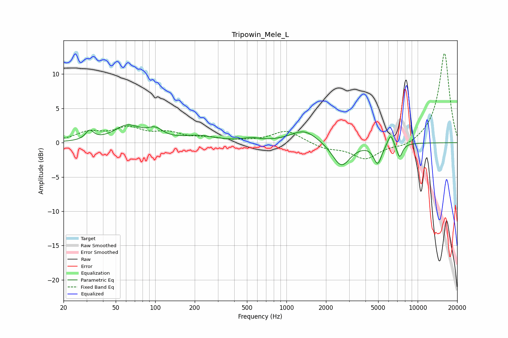

# Tripowin_Mele_L
See [usage instructions](https://github.com/jaakkopasanen/AutoEq#usage) for more options and info.

### Parametric EQs
Apply preamp of -2.7 dB when using parametric equalizer.

|   # | Type    |   Fc (Hz) |    Q |   Gain (dB) |
|-----|---------|-----------|------|-------------|
|   1 | Peaking |        32 | 4.82 |         1.3 |
|   2 | Peaking |        61 | 1.42 |         2.3 |
|   3 | Peaking |       100 | 2.45 |         1.3 |
|   4 | Peaking |       215 | 1.12 |         0.9 |
|   5 | Peaking |       539 | 2.32 |         0.4 |
|   6 | Peaking |      1367 | 1.39 |         1.9 |
|   7 | Peaking |      2618 | 2.08 |        -3.5 |
|   8 | Peaking |      4954 | 4.62 |        -2.8 |
|   9 | Peaking |      6220 | 5.99 |         1.8 |
|  10 | Peaking |      7279 | 6    |        -2.1 |

### Fixed Band EQs
When using fixed band (also called graphic) equalizer, apply preamp of **-13.1 dB** (if available) and set gains manually with these parameters.

|   # | Type    |   Fc (Hz) |    Q |   Gain (dB) |
|-----|---------|-----------|------|-------------|
|   1 | Peaking |        31 | 1.41 |         1.4 |
|   2 | Peaking |        62 | 1.41 |         1.9 |
|   3 | Peaking |       125 | 1.41 |         1.2 |
|   4 | Peaking |       250 | 1.41 |         0.6 |
|   5 | Peaking |       500 | 1.41 |         0.1 |
|   6 | Peaking |      1000 | 1.41 |         1.8 |
|   7 | Peaking |      2000 | 1.41 |        -0.8 |
|   8 | Peaking |      4000 | 1.41 |        -2.3 |
|   9 | Peaking |      8000 | 1.41 |        -0.7 |
|  10 | Peaking |     16000 | 1.41 |        13.2 |

### Graphs

