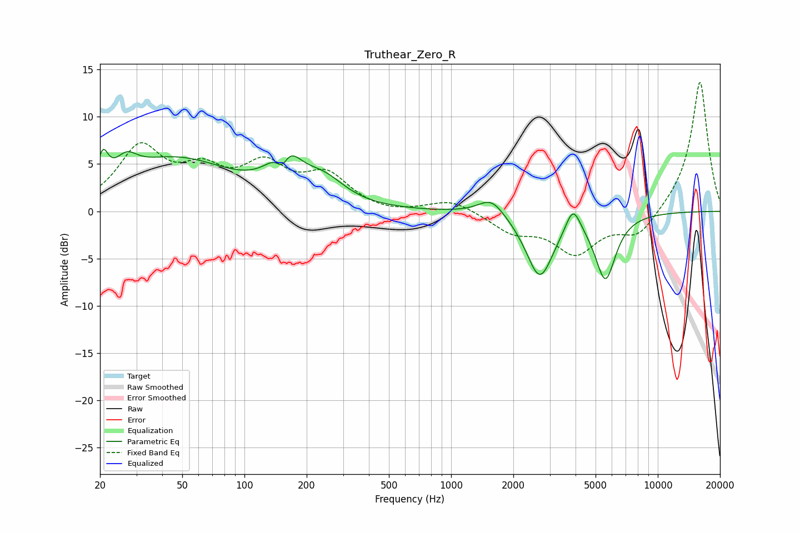

# Truthear_Zero_R
See [usage instructions](https://github.com/jaakkopasanen/AutoEq#usage) for more options and info.

### Parametric EQs
Apply preamp of -6.7 dB when using parametric equalizer.

|   # | Type    |   Fc (Hz) |    Q |   Gain (dB) |
|-----|---------|-----------|------|-------------|
|   1 | Peaking |        21 | 5.89 |         2.9 |
|   2 | Peaking |        27 | 2.81 |         1.9 |
|   3 | Peaking |        46 | 0.5  |         5.4 |
|   4 | Peaking |       152 | 4.56 |        -2.6 |
|   5 | Peaking |       157 | 2.1  |         5   |
|   6 | Peaking |       242 | 1.36 |         2.5 |
|   7 | Peaking |      1568 | 2.22 |         1.9 |
|   8 | Peaking |      2685 | 2.11 |        -6.9 |
|   9 | Peaking |      3889 | 4.05 |         2.7 |
|  10 | Peaking |      5578 | 2.78 |        -6.9 |

### Fixed Band EQs
When using fixed band (also called graphic) equalizer, apply preamp of **-13.8 dB** (if available) and set gains manually with these parameters.

|   # | Type    |   Fc (Hz) |    Q |   Gain (dB) |
|-----|---------|-----------|------|-------------|
|   1 | Peaking |        31 | 1.41 |         6.4 |
|   2 | Peaking |        62 | 1.41 |         3.4 |
|   3 | Peaking |       125 | 1.41 |         4.3 |
|   4 | Peaking |       250 | 1.41 |         3.5 |
|   5 | Peaking |       500 | 1.41 |        -0.4 |
|   6 | Peaking |      1000 | 1.41 |         1.3 |
|   7 | Peaking |      2000 | 1.41 |        -2   |
|   8 | Peaking |      4000 | 1.41 |        -4.2 |
|   9 | Peaking |      8000 | 1.41 |        -2.6 |
|  10 | Peaking |     16000 | 1.41 |        13.9 |

### Graphs

