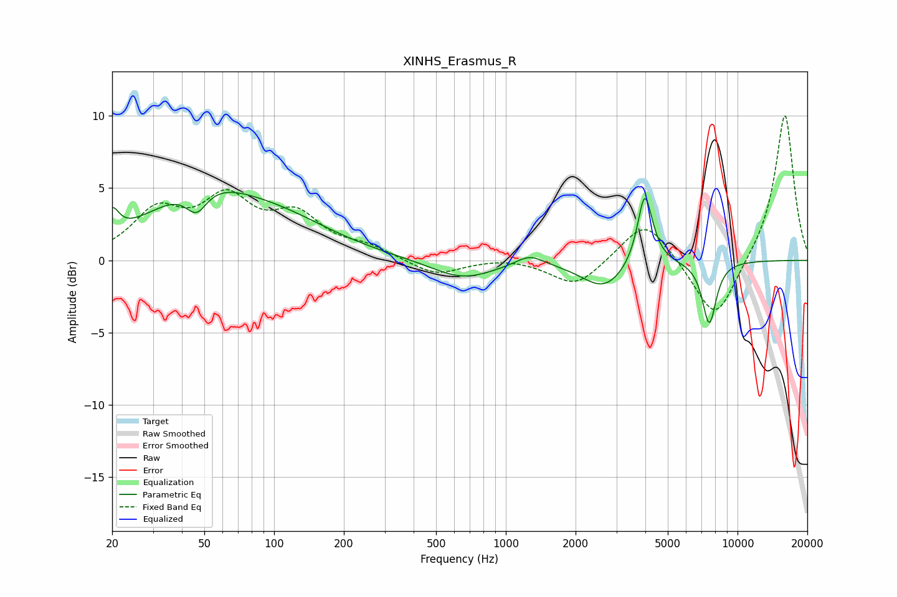

# XINHS_Erasmus_R
See [usage instructions](https://github.com/jaakkopasanen/AutoEq#usage) for more options and info.

### Parametric EQs
Apply preamp of -4.8 dB when using parametric equalizer.

|   # | Type    |   Fc (Hz) |    Q |   Gain (dB) |
|-----|---------|-----------|------|-------------|
|   1 | Peaking |        20 | 4.91 |         1.8 |
|   2 | Peaking |        46 | 3.09 |        -1.8 |
|   3 | Peaking |        48 | 0.61 |         4.3 |
|   4 | Peaking |       110 | 0.59 |         1.9 |
|   5 | Peaking |       650 | 1.04 |        -1.3 |
|   6 | Peaking |      1269 | 2.29 |         0.8 |
|   7 | Peaking |      2656 | 1.48 |        -1.9 |
|   8 | Peaking |      3969 | 5    |         3.6 |
|   9 | Peaking |      4050 | 3.07 |         1.5 |
|  10 | Peaking |      7551 | 4.42 |        -4.3 |

### Fixed Band EQs
When using fixed band (also called graphic) equalizer, apply preamp of **-10.1 dB** (if available) and set gains manually with these parameters.

|   # | Type    |   Fc (Hz) |    Q |   Gain (dB) |
|-----|---------|-----------|------|-------------|
|   1 | Peaking |        31 | 1.41 |         3.1 |
|   2 | Peaking |        62 | 1.41 |         3.8 |
|   3 | Peaking |       125 | 1.41 |         2.7 |
|   4 | Peaking |       250 | 1.41 |         0.8 |
|   5 | Peaking |       500 | 1.41 |        -1.1 |
|   6 | Peaking |      1000 | 1.41 |         0.2 |
|   7 | Peaking |      2000 | 1.41 |        -1.9 |
|   8 | Peaking |      4000 | 1.41 |         3   |
|   9 | Peaking |      8000 | 1.41 |        -4.4 |
|  10 | Peaking |     16000 | 1.41 |        10.3 |

### Graphs

