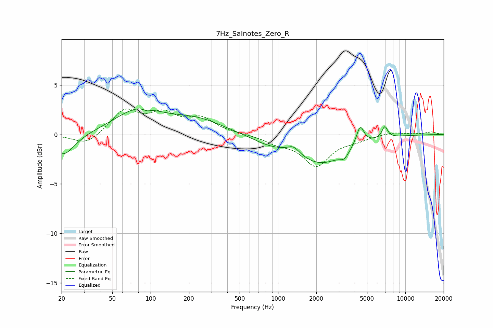

# 7Hz_Salnotes_Zero_R
See [usage instructions](https://github.com/jaakkopasanen/AutoEq#usage) for more options and info.

### Parametric EQs
Apply preamp of -2.7 dB when using parametric equalizer.

|   # | Type    |   Fc (Hz) |    Q |   Gain (dB) |
|-----|---------|-----------|------|-------------|
|   1 | Peaking |        21 | 1.6  |        -2.2 |
|   2 | Peaking |        80 | 0.78 |         2.4 |
|   3 | Peaking |        94 | 5.03 |        -0.2 |
|   4 | Peaking |       228 | 0.68 |         1.4 |
|   5 | Peaking |       834 | 1.06 |        -0.6 |
|   6 | Peaking |      1325 | 3.16 |         0.7 |
|   7 | Peaking |      2170 | 0.73 |        -2.8 |
|   8 | Peaking |      3316 | 4.04 |        -0.7 |
|   9 | Peaking |      4420 | 4.63 |         2   |
|  10 | Peaking |      6896 | 6    |         1.2 |

### Fixed Band EQs
When using fixed band (also called graphic) equalizer, apply preamp of **-2.7 dB** (if available) and set gains manually with these parameters.

|   # | Type    |   Fc (Hz) |    Q |   Gain (dB) |
|-----|---------|-----------|------|-------------|
|   1 | Peaking |        31 | 1.41 |        -1.1 |
|   2 | Peaking |        62 | 1.41 |         2.4 |
|   3 | Peaking |       125 | 1.41 |         1.8 |
|   4 | Peaking |       250 | 1.41 |         1.5 |
|   5 | Peaking |       500 | 1.41 |         0   |
|   6 | Peaking |      1000 | 1.41 |        -0.7 |
|   7 | Peaking |      2000 | 1.41 |        -3.1 |
|   8 | Peaking |      4000 | 1.41 |        -0.5 |
|   9 | Peaking |      8000 | 1.41 |         0.3 |
|  10 | Peaking |     16000 | 1.41 |         0.3 |

### Graphs

