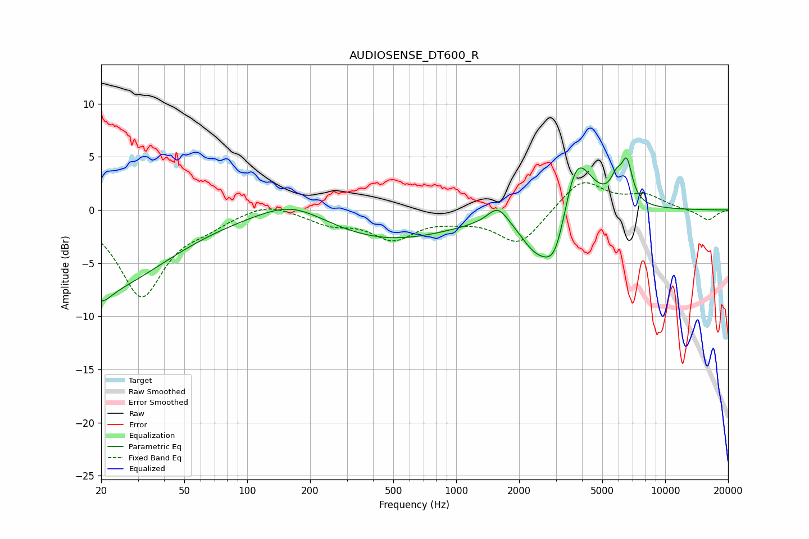

# AUDIOSENSE_DT600_R
See [usage instructions](https://github.com/jaakkopasanen/AutoEq#usage) for more options and info.

### Parametric EQs
Apply preamp of -5.0 dB when using parametric equalizer.

|   # | Type    |   Fc (Hz) |    Q |   Gain (dB) |
|-----|---------|-----------|------|-------------|
|   1 | Peaking |        20 | 2.97 |        -1.4 |
|   2 | Peaking |        21 | 0.47 |        -7.1 |
|   3 | Peaking |       164 | 0.9  |         1.9 |
|   4 | Peaking |       466 | 0.44 |        -2.8 |
|   5 | Peaking |      1585 | 2.85 |         1.8 |
|   6 | Peaking |      2387 | 1.85 |        -2.8 |
|   7 | Peaking |      2989 | 2.27 |        -5.6 |
|   8 | Peaking |      3732 | 1.93 |         6.9 |
|   9 | Peaking |      5842 | 5.07 |         1.8 |
|  10 | Peaking |      6552 | 5.24 |         3.7 |

### Fixed Band EQs
When using fixed band (also called graphic) equalizer, apply preamp of **-2.7 dB** (if available) and set gains manually with these parameters.

|   # | Type    |   Fc (Hz) |    Q |   Gain (dB) |
|-----|---------|-----------|------|-------------|
|   1 | Peaking |        31 | 1.41 |        -8   |
|   2 | Peaking |        62 | 1.41 |        -1   |
|   3 | Peaking |       125 | 1.41 |         0.9 |
|   4 | Peaking |       250 | 1.41 |        -1.1 |
|   5 | Peaking |       500 | 1.41 |        -2.5 |
|   6 | Peaking |      1000 | 1.41 |        -0.5 |
|   7 | Peaking |      2000 | 1.41 |        -3.3 |
|   8 | Peaking |      4000 | 1.41 |         3   |
|   9 | Peaking |      8000 | 1.41 |         1.3 |
|  10 | Peaking |     16000 | 1.41 |        -1   |

### Graphs

