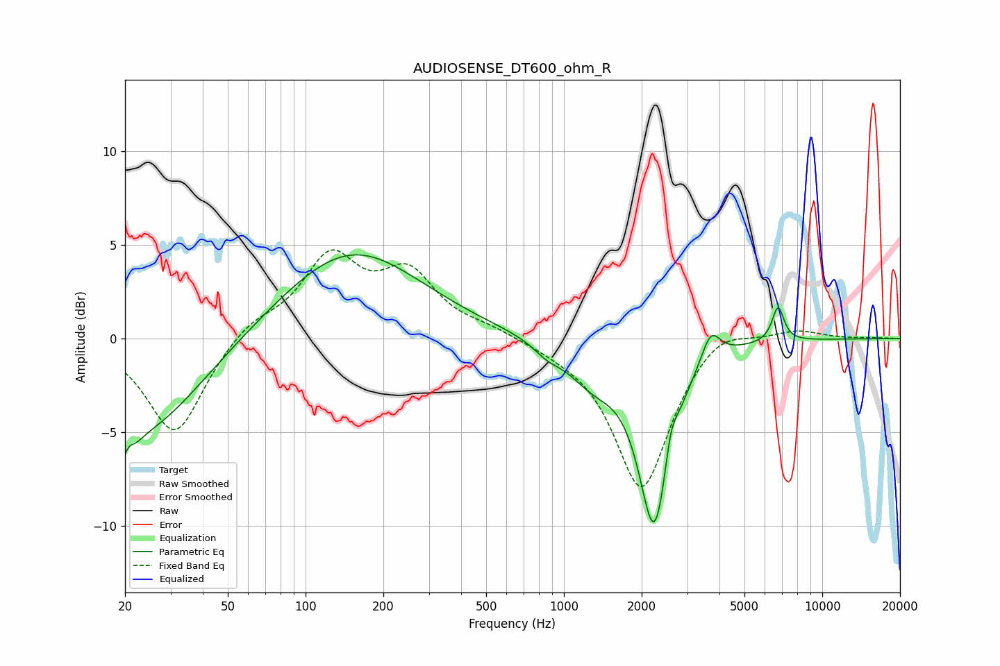

# AUDIOSENSE_DT600_ohm_R
See [usage instructions](https://github.com/jaakkopasanen/AutoEq#usage) for more options and info.

### Parametric EQs
Apply preamp of -4.6 dB when using parametric equalizer.

|   # | Type    |   Fc (Hz) |    Q |   Gain (dB) |
|-----|---------|-----------|------|-------------|
|   1 | Peaking |        20 | 4.49 |        -4.9 |
|   2 | Peaking |        20 | 5.94 |         3.2 |
|   3 | Peaking |        24 | 0.64 |        -4.9 |
|   4 | Peaking |       150 | 0.52 |         4.8 |
|   5 | Peaking |       862 | 2.71 |        -0.5 |
|   6 | Peaking |      1292 | 1.42 |        -1.8 |
|   7 | Peaking |      2244 | 2.28 |        -9.8 |
|   8 | Peaking |      2590 | 6    |         1.6 |
|   9 | Peaking |      3701 | 3.86 |         1.7 |
|  10 | Peaking |      6744 | 6    |         1.9 |

### Fixed Band EQs
When using fixed band (also called graphic) equalizer, apply preamp of **-4.8 dB** (if available) and set gains manually with these parameters.

|   # | Type    |   Fc (Hz) |    Q |   Gain (dB) |
|-----|---------|-----------|------|-------------|
|   1 | Peaking |        31 | 1.41 |        -5.2 |
|   2 | Peaking |        62 | 1.41 |         0.9 |
|   3 | Peaking |       125 | 1.41 |         4.2 |
|   4 | Peaking |       250 | 1.41 |         3.2 |
|   5 | Peaking |       500 | 1.41 |         0.4 |
|   6 | Peaking |      1000 | 1.41 |        -0.3 |
|   7 | Peaking |      2000 | 1.41 |        -8.1 |
|   8 | Peaking |      4000 | 1.41 |         1   |
|   9 | Peaking |      8000 | 1.41 |         0.5 |
|  10 | Peaking |     16000 | 1.41 |         0   |

### Graphs

