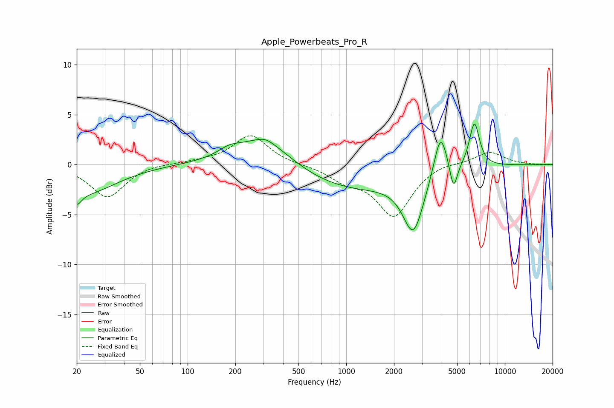

# Apple_Powerbeats_Pro_R
See [usage instructions](https://github.com/jaakkopasanen/AutoEq#usage) for more options and info.

### Parametric EQs
Apply preamp of -4.1 dB when using parametric equalizer.

|   # | Type    |   Fc (Hz) |    Q |   Gain (dB) |
|-----|---------|-----------|------|-------------|
|   1 | Peaking |        20 | 4.97 |        -1.3 |
|   2 | Peaking |        22 | 0.72 |        -2.8 |
|   3 | Peaking |       183 | 2.01 |         0.7 |
|   4 | Peaking |       306 | 0.78 |         3   |
|   5 | Peaking |       308 | 2.78 |         0.4 |
|   6 | Peaking |      1040 | 0.4  |        -2.5 |
|   7 | Peaking |      2650 | 2.18 |        -5.7 |
|   8 | Peaking |      3928 | 3.37 |         4.6 |
|   9 | Peaking |      4749 | 5.94 |        -2.7 |
|  10 | Peaking |      6427 | 4.28 |         4.5 |

### Fixed Band EQs
When using fixed band (also called graphic) equalizer, apply preamp of **-3.0 dB** (if available) and set gains manually with these parameters.

|   # | Type    |   Fc (Hz) |    Q |   Gain (dB) |
|-----|---------|-----------|------|-------------|
|   1 | Peaking |        31 | 1.41 |        -3.3 |
|   2 | Peaking |        62 | 1.41 |         0.2 |
|   3 | Peaking |       125 | 1.41 |         0.3 |
|   4 | Peaking |       250 | 1.41 |         2.9 |
|   5 | Peaking |       500 | 1.41 |        -0   |
|   6 | Peaking |      1000 | 1.41 |        -1.3 |
|   7 | Peaking |      2000 | 1.41 |        -5.1 |
|   8 | Peaking |      4000 | 1.41 |         0.3 |
|   9 | Peaking |      8000 | 1.41 |         1.3 |
|  10 | Peaking |     16000 | 1.41 |        -0   |

### Graphs

