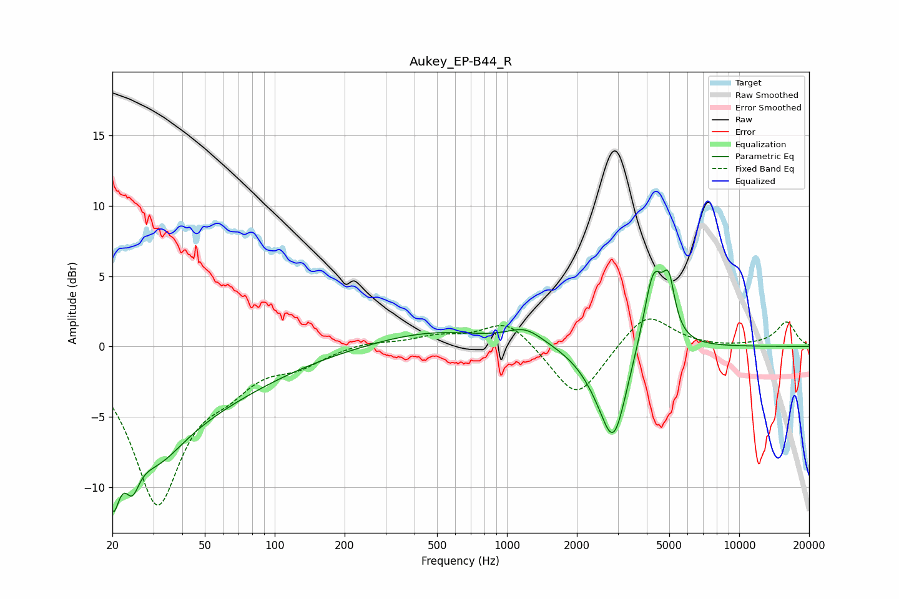

# Aukey_EP-B44_R
See [usage instructions](https://github.com/jaakkopasanen/AutoEq#usage) for more options and info.

### Parametric EQs
Apply preamp of -5.5 dB when using parametric equalizer.

|   # | Type    |   Fc (Hz) |    Q |   Gain (dB) |
|-----|---------|-----------|------|-------------|
|   1 | Peaking |        20 | 4.73 |        -5.5 |
|   2 | Peaking |        24 | 4.73 |        -2.5 |
|   3 | Peaking |        31 | 1.17 |        -3.3 |
|   4 | Peaking |        32 | 0.34 |        -4.6 |
|   5 | Peaking |       477 | 0.58 |         1.1 |
|   6 | Peaking |      1202 | 1.81 |         1.1 |
|   7 | Peaking |      2458 | 1.7  |        -1.3 |
|   8 | Peaking |      2882 | 2.51 |        -6   |
|   9 | Peaking |      4272 | 3.18 |         5.7 |
|  10 | Peaking |      4979 | 5.51 |         3.3 |

### Fixed Band EQs
When using fixed band (also called graphic) equalizer, apply preamp of **-2.0 dB** (if available) and set gains manually with these parameters.

|   # | Type    |   Fc (Hz) |    Q |   Gain (dB) |
|-----|---------|-----------|------|-------------|
|   1 | Peaking |        31 | 1.41 |       -10.9 |
|   2 | Peaking |        62 | 1.41 |        -1.8 |
|   3 | Peaking |       125 | 1.41 |        -1.1 |
|   4 | Peaking |       250 | 1.41 |         0.4 |
|   5 | Peaking |       500 | 1.41 |         0.6 |
|   6 | Peaking |      1000 | 1.41 |         1.9 |
|   7 | Peaking |      2000 | 1.41 |        -3.9 |
|   8 | Peaking |      4000 | 1.41 |         2.5 |
|   9 | Peaking |      8000 | 1.41 |        -0.1 |
|  10 | Peaking |     16000 | 1.41 |         1.7 |

### Graphs

