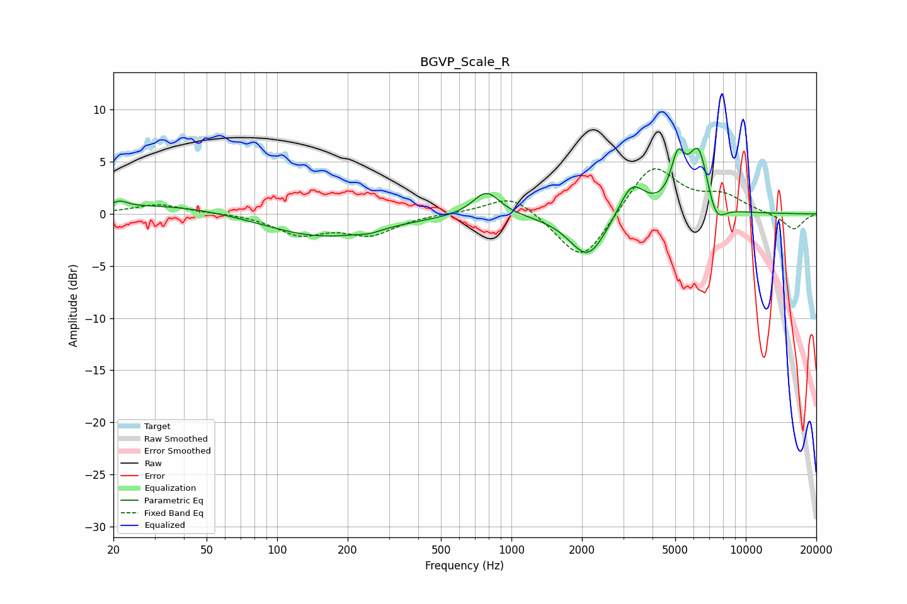

# BGVP_Scale_R
See [usage instructions](https://github.com/jaakkopasanen/AutoEq#usage) for more options and info.

### Parametric EQs
Apply preamp of -6.4 dB when using parametric equalizer.

|   # | Type    |   Fc (Hz) |    Q |   Gain (dB) |
|-----|---------|-----------|------|-------------|
|   1 | Peaking |        21 | 4.72 |         0.6 |
|   2 | Peaking |        34 | 0.45 |         1   |
|   3 | Peaking |       153 | 0.58 |        -2.3 |
|   4 | Peaking |       249 | 2.95 |        -0.3 |
|   5 | Peaking |       782 | 2.43 |         2.4 |
|   6 | Peaking |      2120 | 1.79 |        -4.3 |
|   7 | Peaking |      3261 | 2.53 |         3.3 |
|   8 | Peaking |      5128 | 4.68 |         4.1 |
|   9 | Peaking |      6294 | 3.03 |         6.3 |
|  10 | Peaking |      7428 | 3.33 |        -2.5 |

### Fixed Band EQs
When using fixed band (also called graphic) equalizer, apply preamp of **-4.4 dB** (if available) and set gains manually with these parameters.

|   # | Type    |   Fc (Hz) |    Q |   Gain (dB) |
|-----|---------|-----------|------|-------------|
|   1 | Peaking |        31 | 1.41 |         0.9 |
|   2 | Peaking |        62 | 1.41 |         0.1 |
|   3 | Peaking |       125 | 1.41 |        -1.9 |
|   4 | Peaking |       250 | 1.41 |        -1.9 |
|   5 | Peaking |       500 | 1.41 |         0.1 |
|   6 | Peaking |      1000 | 1.41 |         2   |
|   7 | Peaking |      2000 | 1.41 |        -4.9 |
|   8 | Peaking |      4000 | 1.41 |         4.9 |
|   9 | Peaking |      8000 | 1.41 |         1.6 |
|  10 | Peaking |     16000 | 1.41 |        -1.6 |

### Graphs

