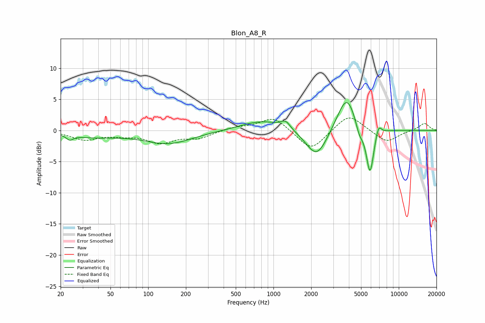

# Blon_A8_R
See [usage instructions](https://github.com/jaakkopasanen/AutoEq#usage) for more options and info.

### Parametric EQs
Apply preamp of -4.6 dB when using parametric equalizer.

|   # | Type    |   Fc (Hz) |    Q |   Gain (dB) |
|-----|---------|-----------|------|-------------|
|   1 | Peaking |        24 | 5.6  |        -0.8 |
|   2 | Peaking |        36 | 0.68 |        -0.9 |
|   3 | Peaking |       145 | 0.74 |        -2.1 |
|   4 | Peaking |       818 | 0.82 |         1.6 |
|   5 | Peaking |      1250 | 3.82 |         1.2 |
|   6 | Peaking |      2215 | 1.63 |        -4.7 |
|   7 | Peaking |      3837 | 1.85 |         6.1 |
|   8 | Peaking |      4837 | 4.72 |        -1.9 |
|   9 | Peaking |      5890 | 4.46 |        -7.6 |
|  10 | Peaking |      6895 | 5.99 |         1.8 |

### Fixed Band EQs
When using fixed band (also called graphic) equalizer, apply preamp of **-2.1 dB** (if available) and set gains manually with these parameters.

|   # | Type    |   Fc (Hz) |    Q |   Gain (dB) |
|-----|---------|-----------|------|-------------|
|   1 | Peaking |        31 | 1.41 |        -1.4 |
|   2 | Peaking |        62 | 1.41 |        -0.6 |
|   3 | Peaking |       125 | 1.41 |        -1.8 |
|   4 | Peaking |       250 | 1.41 |        -1.1 |
|   5 | Peaking |       500 | 1.41 |         0.5 |
|   6 | Peaking |      1000 | 1.41 |         2.2 |
|   7 | Peaking |      2000 | 1.41 |        -3.3 |
|   8 | Peaking |      4000 | 1.41 |         2.8 |
|   9 | Peaking |      8000 | 1.41 |        -2   |
|  10 | Peaking |     16000 | 1.41 |         1.2 |

### Graphs

