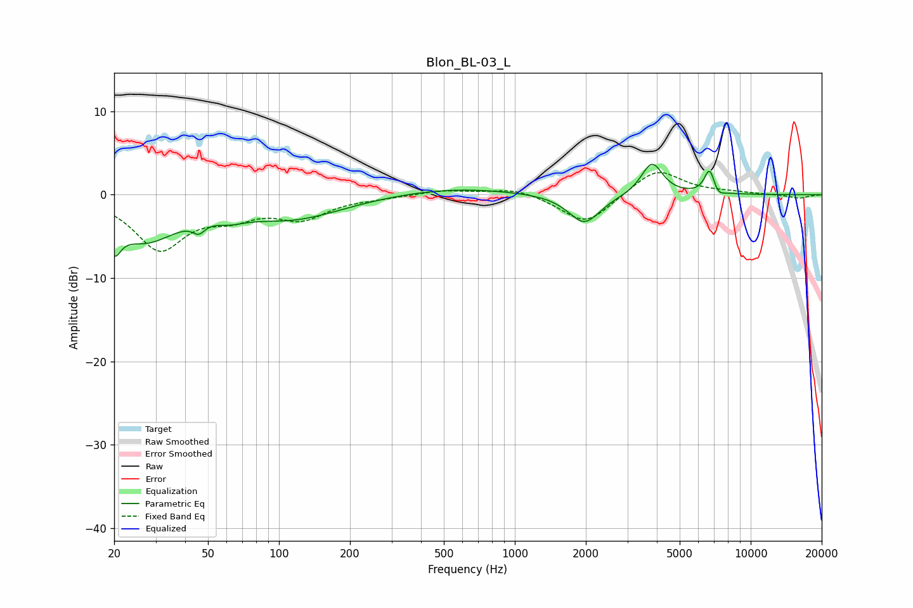

# Blon_BL-03_L
See [usage instructions](https://github.com/jaakkopasanen/AutoEq#usage) for more options and info.

### Parametric EQs
Apply preamp of -3.7 dB when using parametric equalizer.

|   # | Type    |   Fc (Hz) |    Q |   Gain (dB) |
|-----|---------|-----------|------|-------------|
|   1 | Peaking |        20 | 5.06 |        -3.4 |
|   2 | Peaking |        27 | 1    |        -5.1 |
|   3 | Peaking |        46 | 5.7  |        -1.2 |
|   4 | Peaking |        62 | 2.13 |        -0.8 |
|   5 | Peaking |       114 | 0.66 |        -2.7 |
|   6 | Peaking |       541 | 0.56 |         0.9 |
|   7 | Peaking |      1972 | 2.11 |        -3.6 |
|   8 | Peaking |      3814 | 3.12 |         3.9 |
|   9 | Peaking |      6701 | 6    |         3.1 |
|  10 | Peaking |      7229 | 5.59 |        -0.9 |

### Fixed Band EQs
When using fixed band (also called graphic) equalizer, apply preamp of **-2.8 dB** (if available) and set gains manually with these parameters.

|   # | Type    |   Fc (Hz) |    Q |   Gain (dB) |
|-----|---------|-----------|------|-------------|
|   1 | Peaking |        31 | 1.41 |        -6.3 |
|   2 | Peaking |        62 | 1.41 |        -2   |
|   3 | Peaking |       125 | 1.41 |        -2.6 |
|   4 | Peaking |       250 | 1.41 |        -0.3 |
|   5 | Peaking |       500 | 1.41 |         0.6 |
|   6 | Peaking |      1000 | 1.41 |         0.9 |
|   7 | Peaking |      2000 | 1.41 |        -3.6 |
|   8 | Peaking |      4000 | 1.41 |         3.2 |
|   9 | Peaking |      8000 | 1.41 |         0.2 |
|  10 | Peaking |     16000 | 1.41 |        -0.4 |

### Graphs

