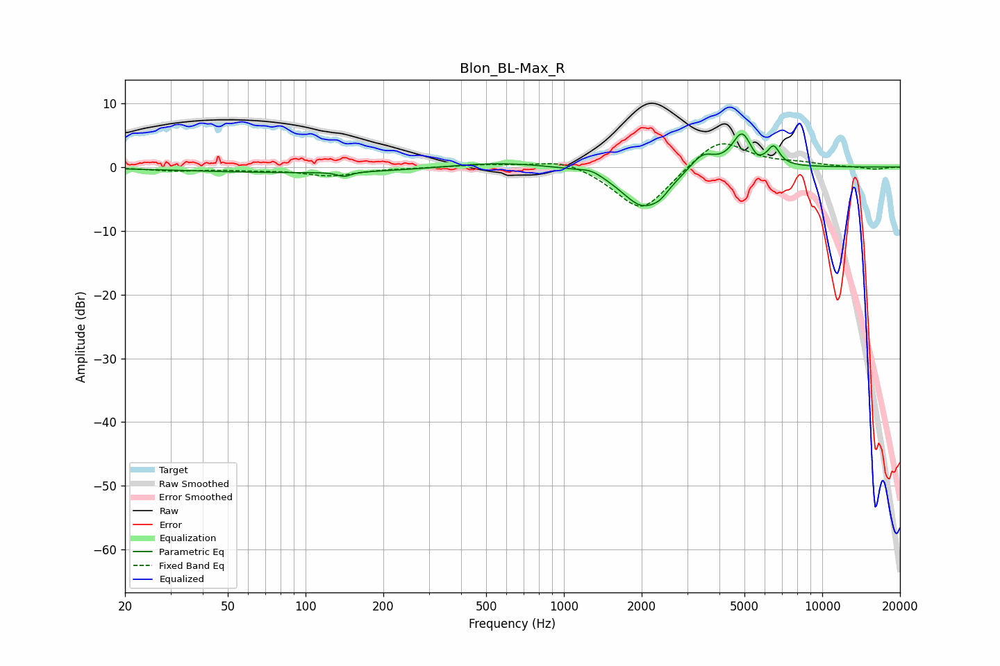

# Blon_BL-Max_R
See [usage instructions](https://github.com/jaakkopasanen/AutoEq#usage) for more options and info.

### Parametric EQs
Apply preamp of -5.3 dB when using parametric equalizer.

|   # | Type    |   Fc (Hz) |    Q |   Gain (dB) |
|-----|---------|-----------|------|-------------|
|   1 | Peaking |       112 | 0.27 |        -0.9 |
|   2 | Peaking |       141 | 5.69 |        -0.7 |
|   3 | Peaking |       551 | 0.66 |         1   |
|   4 | Peaking |      1277 | 3.27 |         0.8 |
|   5 | Peaking |      2025 | 1.64 |        -6.3 |
|   6 | Peaking |      2365 | 4.53 |        -0.9 |
|   7 | Peaking |      3438 | 2.95 |         2.6 |
|   8 | Peaking |      4890 | 3.63 |         5.3 |
|   9 | Peaking |      5565 | 5.98 |        -0.9 |
|  10 | Peaking |      6487 | 5.97 |         2.7 |

### Fixed Band EQs
When using fixed band (also called graphic) equalizer, apply preamp of **-3.7 dB** (if available) and set gains manually with these parameters.

|   # | Type    |   Fc (Hz) |    Q |   Gain (dB) |
|-----|---------|-----------|------|-------------|
|   1 | Peaking |        31 | 1.41 |        -0.5 |
|   2 | Peaking |        62 | 1.41 |        -0.3 |
|   3 | Peaking |       125 | 1.41 |        -1.3 |
|   4 | Peaking |       250 | 1.41 |        -0.1 |
|   5 | Peaking |       500 | 1.41 |         0.4 |
|   6 | Peaking |      1000 | 1.41 |         1.5 |
|   7 | Peaking |      2000 | 1.41 |        -7.2 |
|   8 | Peaking |      4000 | 1.41 |         4.8 |
|   9 | Peaking |      8000 | 1.41 |         0.5 |
|  10 | Peaking |     16000 | 1.41 |        -0.4 |

### Graphs

