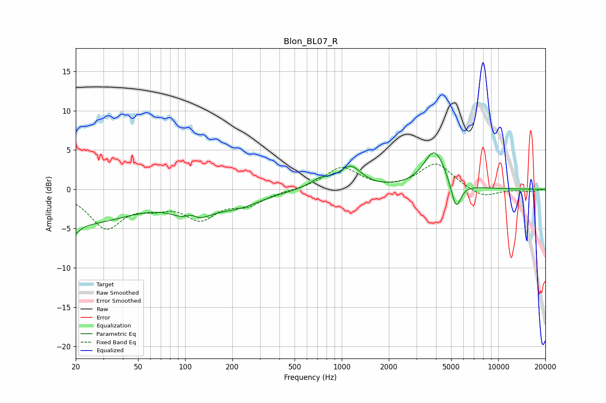

# Blon_BL07_R
See [usage instructions](https://github.com/jaakkopasanen/AutoEq#usage) for more options and info.

### Parametric EQs
Apply preamp of -4.7 dB when using parametric equalizer.

|   # | Type    |   Fc (Hz) |    Q |   Gain (dB) |
|-----|---------|-----------|------|-------------|
|   1 | Peaking |        20 | 5.41 |        -3.5 |
|   2 | Peaking |        20 | 6    |         2.2 |
|   3 | Peaking |        21 | 0.39 |        -4.3 |
|   4 | Peaking |       109 | 3.5  |         1.1 |
|   5 | Peaking |       111 | 1.38 |        -3   |
|   6 | Peaking |       218 | 0.93 |        -1.7 |
|   7 | Peaking |       732 | 2.1  |         1.1 |
|   8 | Peaking |      1138 | 2.03 |         2.7 |
|   9 | Peaking |      3918 | 2.01 |         4.9 |
|  10 | Peaking |      5371 | 4.4  |        -3.6 |

### Fixed Band EQs
When using fixed band (also called graphic) equalizer, apply preamp of **-3.3 dB** (if available) and set gains manually with these parameters.

|   # | Type    |   Fc (Hz) |    Q |   Gain (dB) |
|-----|---------|-----------|------|-------------|
|   1 | Peaking |        31 | 1.41 |        -4.7 |
|   2 | Peaking |        62 | 1.41 |        -1.5 |
|   3 | Peaking |       125 | 1.41 |        -3.3 |
|   4 | Peaking |       250 | 1.41 |        -1.7 |
|   5 | Peaking |       500 | 1.41 |        -0.1 |
|   6 | Peaking |      1000 | 1.41 |         2.8 |
|   7 | Peaking |      2000 | 1.41 |        -0.1 |
|   8 | Peaking |      4000 | 1.41 |         3.3 |
|   9 | Peaking |      8000 | 1.41 |        -1.1 |
|  10 | Peaking |     16000 | 1.41 |        -0.3 |

### Graphs

