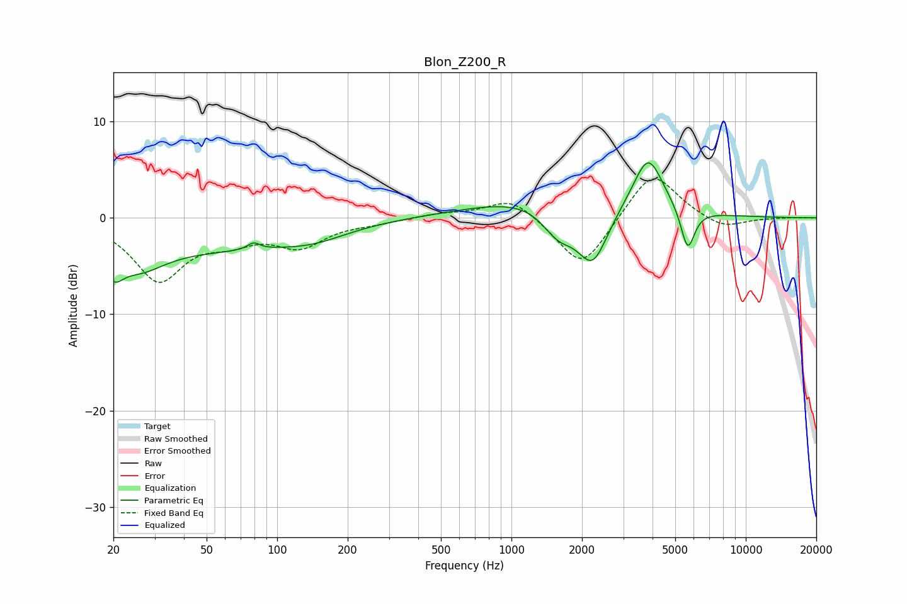

# Blon_Z200_R
See [usage instructions](https://github.com/jaakkopasanen/AutoEq#usage) for more options and info.

### Parametric EQs
Apply preamp of -5.8 dB when using parametric equalizer.

|   # | Type    |   Fc (Hz) |    Q |   Gain (dB) |
|-----|---------|-----------|------|-------------|
|   1 | Peaking |        20 | 3.58 |        -2.7 |
|   2 | Peaking |        25 | 1.2  |        -3.4 |
|   3 | Peaking |        56 | 0.42 |        -2.7 |
|   4 | Peaking |        79 | 5.62 |         0.7 |
|   5 | Peaking |       142 | 0.94 |        -1.2 |
|   6 | Peaking |      1532 | 0.47 |         2.6 |
|   7 | Peaking |      1586 | 1.95 |        -3.2 |
|   8 | Peaking |      2222 | 2.06 |        -6.2 |
|   9 | Peaking |      3833 | 2.21 |         5.8 |
|  10 | Peaking |      5651 | 4.69 |        -4.4 |

### Fixed Band EQs
When using fixed band (also called graphic) equalizer, apply preamp of **-4.1 dB** (if available) and set gains manually with these parameters.

|   # | Type    |   Fc (Hz) |    Q |   Gain (dB) |
|-----|---------|-----------|------|-------------|
|   1 | Peaking |        31 | 1.41 |        -6.3 |
|   2 | Peaking |        62 | 1.41 |        -1.8 |
|   3 | Peaking |       125 | 1.41 |        -2.7 |
|   4 | Peaking |       250 | 1.41 |        -0.4 |
|   5 | Peaking |       500 | 1.41 |         0.4 |
|   6 | Peaking |      1000 | 1.41 |         2.2 |
|   7 | Peaking |      2000 | 1.41 |        -5.5 |
|   8 | Peaking |      4000 | 1.41 |         5.1 |
|   9 | Peaking |      8000 | 1.41 |        -1.2 |
|  10 | Peaking |     16000 | 1.41 |         0   |

### Graphs

