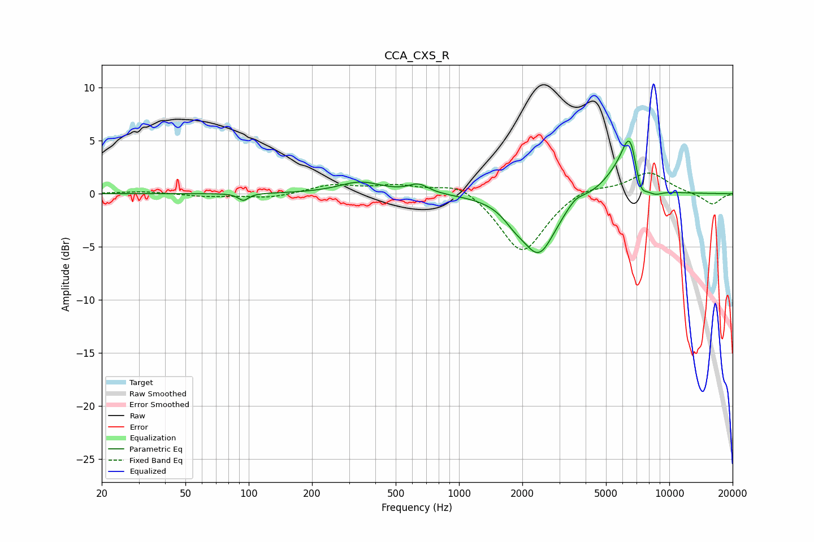

# CCA_CXS_R
See [usage instructions](https://github.com/jaakkopasanen/AutoEq#usage) for more options and info.

### Parametric EQs
Apply preamp of -5.1 dB when using parametric equalizer.

|   # | Type    |   Fc (Hz) |    Q |   Gain (dB) |
|-----|---------|-----------|------|-------------|
|   1 | Peaking |        94 | 5.95 |        -0.7 |
|   2 | Peaking |       339 | 1.4  |         1.1 |
|   3 | Peaking |       641 | 3.01 |         0.8 |
|   4 | Peaking |      1835 | 2.61 |        -1   |
|   5 | Peaking |      2400 | 1.76 |        -5.4 |
|   6 | Peaking |      3584 | 3.57 |         0.7 |
|   7 | Peaking |      5628 | 1.84 |         1.4 |
|   8 | Peaking |      6531 | 3.33 |         5.3 |
|   9 | Peaking |      7247 | 4.39 |        -2.5 |
|  10 | Peaking |      8505 | 3.37 |        -0.6 |

### Fixed Band EQs
When using fixed band (also called graphic) equalizer, apply preamp of **-2.0 dB** (if available) and set gains manually with these parameters.

|   # | Type    |   Fc (Hz) |    Q |   Gain (dB) |
|-----|---------|-----------|------|-------------|
|   1 | Peaking |        31 | 1.41 |         0.2 |
|   2 | Peaking |        62 | 1.41 |        -0.3 |
|   3 | Peaking |       125 | 1.41 |        -0.4 |
|   4 | Peaking |       250 | 1.41 |         0.8 |
|   5 | Peaking |       500 | 1.41 |         0.7 |
|   6 | Peaking |      1000 | 1.41 |         1.2 |
|   7 | Peaking |      2000 | 1.41 |        -5.7 |
|   8 | Peaking |      4000 | 1.41 |         0.8 |
|   9 | Peaking |      8000 | 1.41 |         2   |
|  10 | Peaking |     16000 | 1.41 |        -1.1 |

### Graphs

