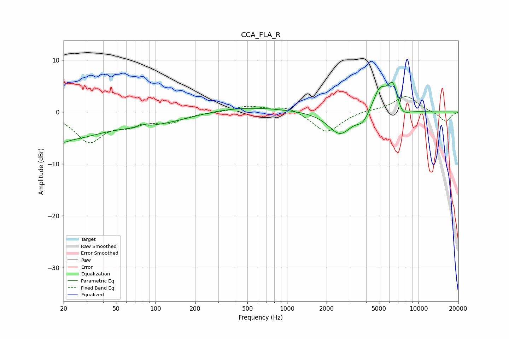

# CCA_FLA_R
See [usage instructions](https://github.com/jaakkopasanen/AutoEq#usage) for more options and info.

### Parametric EQs
Apply preamp of -5.8 dB when using parametric equalizer.

|   # | Type    |   Fc (Hz) |    Q |   Gain (dB) |
|-----|---------|-----------|------|-------------|
|   1 | Peaking |        20 | 4.64 |        -0.7 |
|   2 | Peaking |        21 | 0.6  |        -4.6 |
|   3 | Peaking |        79 | 5.83 |         0.6 |
|   4 | Peaking |        96 | 0.42 |        -2.4 |
|   5 | Peaking |       384 | 0.4  |         1.3 |
|   6 | Peaking |      2530 | 1.62 |        -4.4 |
|   7 | Peaking |      3769 | 3.22 |        -1.8 |
|   8 | Peaking |      5073 | 2.73 |         4.3 |
|   9 | Peaking |      6425 | 3.1  |         5.9 |
|  10 | Peaking |      7372 | 2.69 |        -2.5 |

### Fixed Band EQs
When using fixed band (also called graphic) equalizer, apply preamp of **-3.1 dB** (if available) and set gains manually with these parameters.

|   # | Type    |   Fc (Hz) |    Q |   Gain (dB) |
|-----|---------|-----------|------|-------------|
|   1 | Peaking |        31 | 1.41 |        -5.5 |
|   2 | Peaking |        62 | 1.41 |        -1.9 |
|   3 | Peaking |       125 | 1.41 |        -1.8 |
|   4 | Peaking |       250 | 1.41 |        -0.1 |
|   5 | Peaking |       500 | 1.41 |         1.1 |
|   6 | Peaking |      1000 | 1.41 |         1.2 |
|   7 | Peaking |      2000 | 1.41 |        -4   |
|   8 | Peaking |      4000 | 1.41 |         0.4 |
|   9 | Peaking |      8000 | 1.41 |         3.1 |
|  10 | Peaking |     16000 | 1.41 |        -1.9 |

### Graphs

