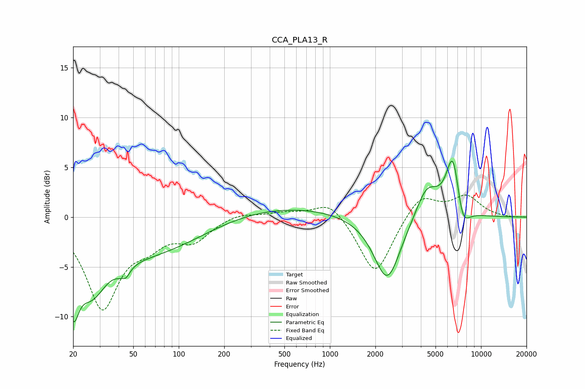

# CCA_PLA13_R
See [usage instructions](https://github.com/jaakkopasanen/AutoEq#usage) for more options and info.

### Parametric EQs
Apply preamp of -5.7 dB when using parametric equalizer.

|   # | Type    |   Fc (Hz) |    Q |   Gain (dB) |
|-----|---------|-----------|------|-------------|
|   1 | Peaking |        20 | 3.93 |        -5.6 |
|   2 | Peaking |        26 | 1.43 |        -4.9 |
|   3 | Peaking |        43 | 6    |         2.5 |
|   4 | Peaking |        43 | 5.04 |        -3.6 |
|   5 | Peaking |        63 | 0.36 |        -3.8 |
|   6 | Peaking |       371 | 0.28 |         1.3 |
|   7 | Peaking |      2397 | 1.58 |        -6.7 |
|   8 | Peaking |      4384 | 1.84 |         3.3 |
|   9 | Peaking |      6534 | 2.94 |         6.6 |
|  10 | Peaking |      7493 | 2.92 |        -3   |

### Fixed Band EQs
When using fixed band (also called graphic) equalizer, apply preamp of **-2.3 dB** (if available) and set gains manually with these parameters.

|   # | Type    |   Fc (Hz) |    Q |   Gain (dB) |
|-----|---------|-----------|------|-------------|
|   1 | Peaking |        31 | 1.41 |        -8.9 |
|   2 | Peaking |        62 | 1.41 |        -1.9 |
|   3 | Peaking |       125 | 1.41 |        -2.1 |
|   4 | Peaking |       250 | 1.41 |         0.5 |
|   5 | Peaking |       500 | 1.41 |         0.4 |
|   6 | Peaking |      1000 | 1.41 |         1.8 |
|   7 | Peaking |      2000 | 1.41 |        -6   |
|   8 | Peaking |      4000 | 1.41 |         2.4 |
|   9 | Peaking |      8000 | 1.41 |         2   |
|  10 | Peaking |     16000 | 1.41 |        -0.1 |

### Graphs

