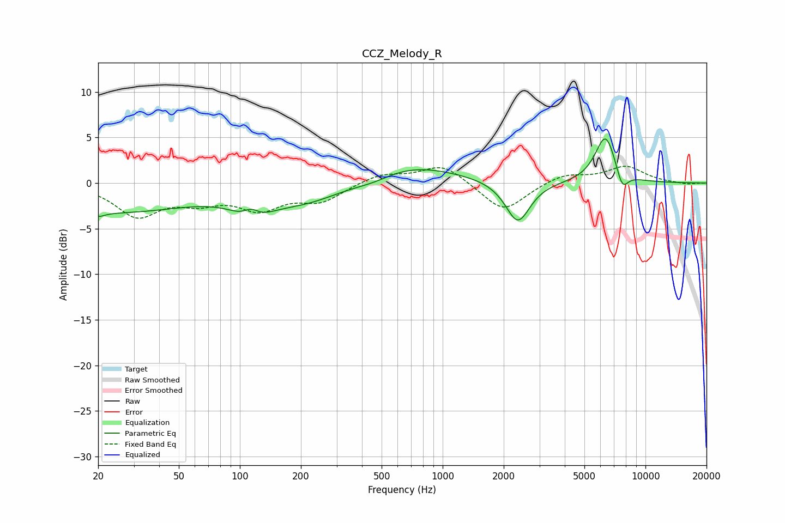

# CCZ_Melody_R
See [usage instructions](https://github.com/jaakkopasanen/AutoEq#usage) for more options and info.

### Parametric EQs
Apply preamp of -4.9 dB when using parametric equalizer.

|   # | Type    |   Fc (Hz) |    Q |   Gain (dB) |
|-----|---------|-----------|------|-------------|
|   1 | Peaking |        20 | 4.31 |        -0.5 |
|   2 | Peaking |        23 | 0.35 |        -3.1 |
|   3 | Peaking |       114 | 3.12 |         2   |
|   4 | Peaking |       114 | 1.84 |        -2.9 |
|   5 | Peaking |       214 | 0.65 |        -2.4 |
|   6 | Peaking |       456 | 1.28 |        -1   |
|   7 | Peaking |       604 | 0.55 |         2.5 |
|   8 | Peaking |      2348 | 2.34 |        -4.6 |
|   9 | Peaking |      6355 | 2.65 |         5.3 |
|  10 | Peaking |      7681 | 4.59 |        -2.1 |

### Fixed Band EQs
When using fixed band (also called graphic) equalizer, apply preamp of **-1.9 dB** (if available) and set gains manually with these parameters.

|   # | Type    |   Fc (Hz) |    Q |   Gain (dB) |
|-----|---------|-----------|------|-------------|
|   1 | Peaking |        31 | 1.41 |        -3.5 |
|   2 | Peaking |        62 | 1.41 |        -1.6 |
|   3 | Peaking |       125 | 1.41 |        -2.6 |
|   4 | Peaking |       250 | 1.41 |        -1.8 |
|   5 | Peaking |       500 | 1.41 |         1   |
|   6 | Peaking |      1000 | 1.41 |         2.1 |
|   7 | Peaking |      2000 | 1.41 |        -3.2 |
|   8 | Peaking |      4000 | 1.41 |         1   |
|   9 | Peaking |      8000 | 1.41 |         1.8 |
|  10 | Peaking |     16000 | 1.41 |        -0.2 |

### Graphs

